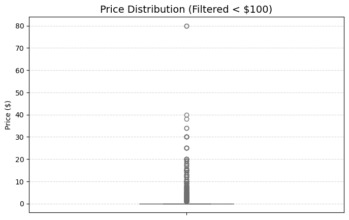
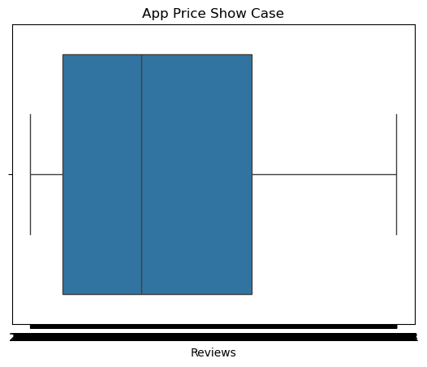
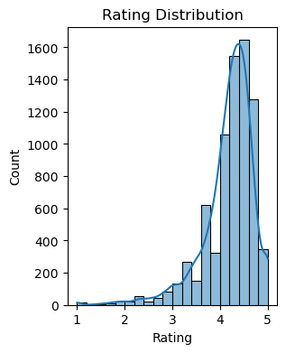
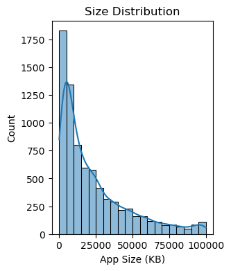
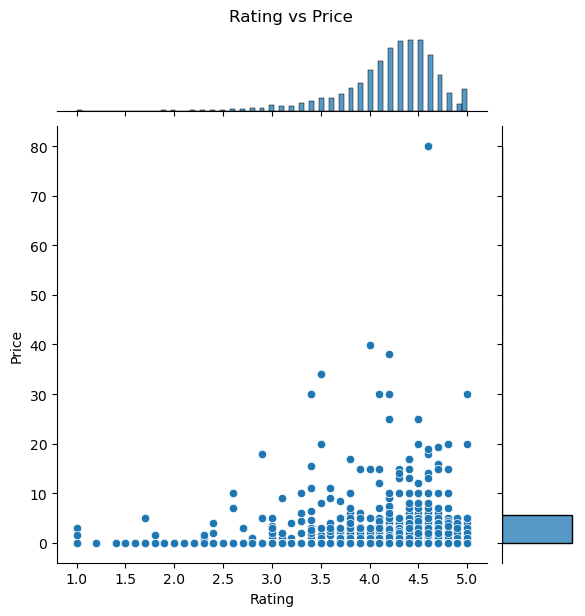
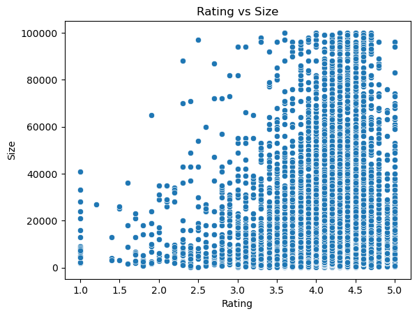
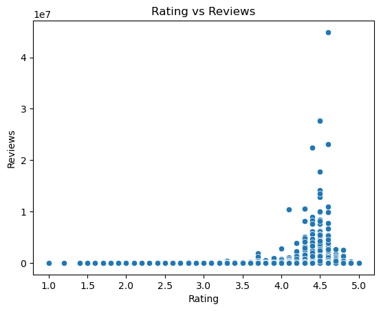
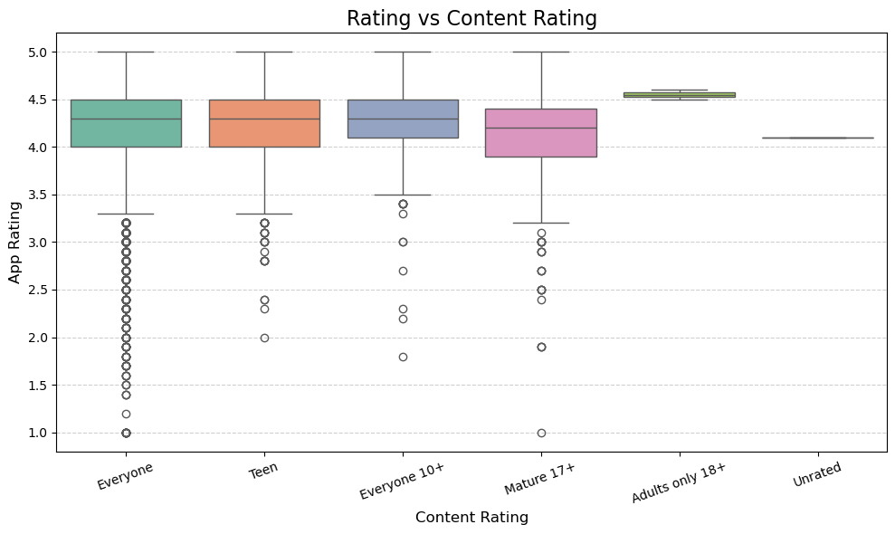
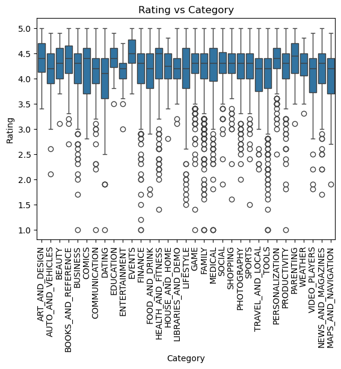

```python
import pandas as pd
df = pd.read_csv('googleplaystore.csv')
df
```


<div>
<style scoped>
    .dataframe tbody tr th:only-of-type {
        vertical-align: middle;
    }

    .dataframe tbody tr th {
        vertical-align: top;
    }

    .dataframe thead th {
        text-align: right;
    }
</style>
<table border="1" class="dataframe">
  <thead>
    <tr style="text-align: right;">
      <th></th>
      <th>App</th>
      <th>Category</th>
      <th>Rating</th>
      <th>Reviews</th>
      <th>Size</th>
      <th>Installs</th>
      <th>Type</th>
      <th>Price</th>
      <th>Content Rating</th>
      <th>Genres</th>
      <th>Last Updated</th>
      <th>Current Ver</th>
      <th>Android Ver</th>
    </tr>
  </thead>
  <tbody>
    <tr>
      <th>0</th>
      <td>Photo Editor &amp; Candy Camera &amp; Grid &amp; ScrapBook</td>
      <td>ART_AND_DESIGN</td>
      <td>4.1</td>
      <td>159</td>
      <td>19M</td>
      <td>10,000+</td>
      <td>Free</td>
      <td>0</td>
      <td>Everyone</td>
      <td>Art &amp; Design</td>
      <td>January 7, 2018</td>
      <td>1.0.0</td>
      <td>4.0.3 and up</td>
    </tr>
    <tr>
      <th>1</th>
      <td>Coloring book moana</td>
      <td>ART_AND_DESIGN</td>
      <td>3.9</td>
      <td>967</td>
      <td>14M</td>
      <td>500,000+</td>
      <td>Free</td>
      <td>0</td>
      <td>Everyone</td>
      <td>Art &amp; Design;Pretend Play</td>
      <td>January 15, 2018</td>
      <td>2.0.0</td>
      <td>4.0.3 and up</td>
    </tr>
    <tr>
      <th>2</th>
      <td>U Launcher Lite – FREE Live Cool Themes, Hide ...</td>
      <td>ART_AND_DESIGN</td>
      <td>4.7</td>
      <td>87510</td>
      <td>8.7M</td>
      <td>5,000,000+</td>
      <td>Free</td>
      <td>0</td>
      <td>Everyone</td>
      <td>Art &amp; Design</td>
      <td>August 1, 2018</td>
      <td>1.2.4</td>
      <td>4.0.3 and up</td>
    </tr>
    <tr>
      <th>3</th>
      <td>Sketch - Draw &amp; Paint</td>
      <td>ART_AND_DESIGN</td>
      <td>4.5</td>
      <td>215644</td>
      <td>25M</td>
      <td>50,000,000+</td>
      <td>Free</td>
      <td>0</td>
      <td>Teen</td>
      <td>Art &amp; Design</td>
      <td>June 8, 2018</td>
      <td>Varies with device</td>
      <td>4.2 and up</td>
    </tr>
    <tr>
      <th>4</th>
      <td>Pixel Draw - Number Art Coloring Book</td>
      <td>ART_AND_DESIGN</td>
      <td>4.3</td>
      <td>967</td>
      <td>2.8M</td>
      <td>100,000+</td>
      <td>Free</td>
      <td>0</td>
      <td>Everyone</td>
      <td>Art &amp; Design;Creativity</td>
      <td>June 20, 2018</td>
      <td>1.1</td>
      <td>4.4 and up</td>
    </tr>
    <tr>
      <th>...</th>
      <td>...</td>
      <td>...</td>
      <td>...</td>
      <td>...</td>
      <td>...</td>
      <td>...</td>
      <td>...</td>
      <td>...</td>
      <td>...</td>
      <td>...</td>
      <td>...</td>
      <td>...</td>
      <td>...</td>
    </tr>
    <tr>
      <th>10836</th>
      <td>Sya9a Maroc - FR</td>
      <td>FAMILY</td>
      <td>4.5</td>
      <td>38</td>
      <td>53M</td>
      <td>5,000+</td>
      <td>Free</td>
      <td>0</td>
      <td>Everyone</td>
      <td>Education</td>
      <td>July 25, 2017</td>
      <td>1.48</td>
      <td>4.1 and up</td>
    </tr>
    <tr>
      <th>10837</th>
      <td>Fr. Mike Schmitz Audio Teachings</td>
      <td>FAMILY</td>
      <td>5.0</td>
      <td>4</td>
      <td>3.6M</td>
      <td>100+</td>
      <td>Free</td>
      <td>0</td>
      <td>Everyone</td>
      <td>Education</td>
      <td>July 6, 2018</td>
      <td>1.0</td>
      <td>4.1 and up</td>
    </tr>
    <tr>
      <th>10838</th>
      <td>Parkinson Exercices FR</td>
      <td>MEDICAL</td>
      <td>NaN</td>
      <td>3</td>
      <td>9.5M</td>
      <td>1,000+</td>
      <td>Free</td>
      <td>0</td>
      <td>Everyone</td>
      <td>Medical</td>
      <td>January 20, 2017</td>
      <td>1.0</td>
      <td>2.2 and up</td>
    </tr>
    <tr>
      <th>10839</th>
      <td>The SCP Foundation DB fr nn5n</td>
      <td>BOOKS_AND_REFERENCE</td>
      <td>4.5</td>
      <td>114</td>
      <td>Varies with device</td>
      <td>1,000+</td>
      <td>Free</td>
      <td>0</td>
      <td>Mature 17+</td>
      <td>Books &amp; Reference</td>
      <td>January 19, 2015</td>
      <td>Varies with device</td>
      <td>Varies with device</td>
    </tr>
    <tr>
      <th>10840</th>
      <td>iHoroscope - 2018 Daily Horoscope &amp; Astrology</td>
      <td>LIFESTYLE</td>
      <td>4.5</td>
      <td>398307</td>
      <td>19M</td>
      <td>10,000,000+</td>
      <td>Free</td>
      <td>0</td>
      <td>Everyone</td>
      <td>Lifestyle</td>
      <td>July 25, 2018</td>
      <td>Varies with device</td>
      <td>Varies with device</td>
    </tr>
  </tbody>
</table>
<p>10841 rows × 13 columns</p>
</div>


```python
# 2. Check for missing values
df.isnull().sum()
```


    App                  0
    Category             0
    Rating            1474
    Reviews              0
    Size                 0
    Installs             0
    Type                 1
    Price                0
    Content Rating       1
    Genres               0
    Last Updated         0
    Current Ver          8
    Android Ver          3
    dtype: int64


```python
# 3. Drop rows with missing values
df1 = df.dropna()
df1.head()

```


<div>
<style scoped>
    .dataframe tbody tr th:only-of-type {
        vertical-align: middle;
    }

    .dataframe tbody tr th {
        vertical-align: top;
    }

    .dataframe thead th {
        text-align: right;
    }
</style>
<table border="1" class="dataframe">
  <thead>
    <tr style="text-align: right;">
      <th></th>
      <th>App</th>
      <th>Category</th>
      <th>Rating</th>
      <th>Reviews</th>
      <th>Size</th>
      <th>Installs</th>
      <th>Type</th>
      <th>Price</th>
      <th>Content Rating</th>
      <th>Genres</th>
      <th>Last Updated</th>
      <th>Current Ver</th>
      <th>Android Ver</th>
    </tr>
  </thead>
  <tbody>
    <tr>
      <th>0</th>
      <td>Photo Editor &amp; Candy Camera &amp; Grid &amp; ScrapBook</td>
      <td>ART_AND_DESIGN</td>
      <td>4.1</td>
      <td>159</td>
      <td>19M</td>
      <td>10,000+</td>
      <td>Free</td>
      <td>0</td>
      <td>Everyone</td>
      <td>Art &amp; Design</td>
      <td>January 7, 2018</td>
      <td>1.0.0</td>
      <td>4.0.3 and up</td>
    </tr>
    <tr>
      <th>1</th>
      <td>Coloring book moana</td>
      <td>ART_AND_DESIGN</td>
      <td>3.9</td>
      <td>967</td>
      <td>14M</td>
      <td>500,000+</td>
      <td>Free</td>
      <td>0</td>
      <td>Everyone</td>
      <td>Art &amp; Design;Pretend Play</td>
      <td>January 15, 2018</td>
      <td>2.0.0</td>
      <td>4.0.3 and up</td>
    </tr>
    <tr>
      <th>2</th>
      <td>U Launcher Lite – FREE Live Cool Themes, Hide ...</td>
      <td>ART_AND_DESIGN</td>
      <td>4.7</td>
      <td>87510</td>
      <td>8.7M</td>
      <td>5,000,000+</td>
      <td>Free</td>
      <td>0</td>
      <td>Everyone</td>
      <td>Art &amp; Design</td>
      <td>August 1, 2018</td>
      <td>1.2.4</td>
      <td>4.0.3 and up</td>
    </tr>
    <tr>
      <th>3</th>
      <td>Sketch - Draw &amp; Paint</td>
      <td>ART_AND_DESIGN</td>
      <td>4.5</td>
      <td>215644</td>
      <td>25M</td>
      <td>50,000,000+</td>
      <td>Free</td>
      <td>0</td>
      <td>Teen</td>
      <td>Art &amp; Design</td>
      <td>June 8, 2018</td>
      <td>Varies with device</td>
      <td>4.2 and up</td>
    </tr>
    <tr>
      <th>4</th>
      <td>Pixel Draw - Number Art Coloring Book</td>
      <td>ART_AND_DESIGN</td>
      <td>4.3</td>
      <td>967</td>
      <td>2.8M</td>
      <td>100,000+</td>
      <td>Free</td>
      <td>0</td>
      <td>Everyone</td>
      <td>Art &amp; Design;Creativity</td>
      <td>June 20, 2018</td>
      <td>1.1</td>
      <td>4.4 and up</td>
    </tr>
  </tbody>
</table>
</div>


```python
## 4. Convert 'Size' to numeric (KB)
import numpy as np
def convert_size(size):
    if size == 'Varies with device' or pd.isnull(size):
        return np.nan
    size = size.strip()
    if size.endswith('M'):
        return float(size[:-1]) * 1000 
    elif size.endswith('k'):
        return float(size[:-1])        
    else:
        return np.nan
df1['Size'] = df['Size'].apply(convert_size)
df1

```

    C:\Users\Anand\AppData\Local\Temp\ipykernel_17352\3178875345.py:13: SettingWithCopyWarning: 
    A value is trying to be set on a copy of a slice from a DataFrame.
    Try using .loc[row_indexer,col_indexer] = value instead
    
    See the caveats in the documentation: https://pandas.pydata.org/pandas-docs/stable/user_guide/indexing.html#returning-a-view-versus-a-copy
      df1['Size'] = df['Size'].apply(convert_size)
    


<div>
<style scoped>
    .dataframe tbody tr th:only-of-type {
        vertical-align: middle;
    }

    .dataframe tbody tr th {
        vertical-align: top;
    }

    .dataframe thead th {
        text-align: right;
    }
</style>
<table border="1" class="dataframe">
  <thead>
    <tr style="text-align: right;">
      <th></th>
      <th>App</th>
      <th>Category</th>
      <th>Rating</th>
      <th>Reviews</th>
      <th>Size</th>
      <th>Installs</th>
      <th>Type</th>
      <th>Price</th>
      <th>Content Rating</th>
      <th>Genres</th>
      <th>Last Updated</th>
      <th>Current Ver</th>
      <th>Android Ver</th>
    </tr>
  </thead>
  <tbody>
    <tr>
      <th>0</th>
      <td>Photo Editor &amp; Candy Camera &amp; Grid &amp; ScrapBook</td>
      <td>ART_AND_DESIGN</td>
      <td>4.1</td>
      <td>159</td>
      <td>19000.0</td>
      <td>10,000+</td>
      <td>Free</td>
      <td>0</td>
      <td>Everyone</td>
      <td>Art &amp; Design</td>
      <td>January 7, 2018</td>
      <td>1.0.0</td>
      <td>4.0.3 and up</td>
    </tr>
    <tr>
      <th>1</th>
      <td>Coloring book moana</td>
      <td>ART_AND_DESIGN</td>
      <td>3.9</td>
      <td>967</td>
      <td>14000.0</td>
      <td>500,000+</td>
      <td>Free</td>
      <td>0</td>
      <td>Everyone</td>
      <td>Art &amp; Design;Pretend Play</td>
      <td>January 15, 2018</td>
      <td>2.0.0</td>
      <td>4.0.3 and up</td>
    </tr>
    <tr>
      <th>2</th>
      <td>U Launcher Lite – FREE Live Cool Themes, Hide ...</td>
      <td>ART_AND_DESIGN</td>
      <td>4.7</td>
      <td>87510</td>
      <td>8700.0</td>
      <td>5,000,000+</td>
      <td>Free</td>
      <td>0</td>
      <td>Everyone</td>
      <td>Art &amp; Design</td>
      <td>August 1, 2018</td>
      <td>1.2.4</td>
      <td>4.0.3 and up</td>
    </tr>
    <tr>
      <th>3</th>
      <td>Sketch - Draw &amp; Paint</td>
      <td>ART_AND_DESIGN</td>
      <td>4.5</td>
      <td>215644</td>
      <td>25000.0</td>
      <td>50,000,000+</td>
      <td>Free</td>
      <td>0</td>
      <td>Teen</td>
      <td>Art &amp; Design</td>
      <td>June 8, 2018</td>
      <td>Varies with device</td>
      <td>4.2 and up</td>
    </tr>
    <tr>
      <th>4</th>
      <td>Pixel Draw - Number Art Coloring Book</td>
      <td>ART_AND_DESIGN</td>
      <td>4.3</td>
      <td>967</td>
      <td>2800.0</td>
      <td>100,000+</td>
      <td>Free</td>
      <td>0</td>
      <td>Everyone</td>
      <td>Art &amp; Design;Creativity</td>
      <td>June 20, 2018</td>
      <td>1.1</td>
      <td>4.4 and up</td>
    </tr>
    <tr>
      <th>...</th>
      <td>...</td>
      <td>...</td>
      <td>...</td>
      <td>...</td>
      <td>...</td>
      <td>...</td>
      <td>...</td>
      <td>...</td>
      <td>...</td>
      <td>...</td>
      <td>...</td>
      <td>...</td>
      <td>...</td>
    </tr>
    <tr>
      <th>10834</th>
      <td>FR Calculator</td>
      <td>FAMILY</td>
      <td>4.0</td>
      <td>7</td>
      <td>2600.0</td>
      <td>500+</td>
      <td>Free</td>
      <td>0</td>
      <td>Everyone</td>
      <td>Education</td>
      <td>June 18, 2017</td>
      <td>1.0.0</td>
      <td>4.1 and up</td>
    </tr>
    <tr>
      <th>10836</th>
      <td>Sya9a Maroc - FR</td>
      <td>FAMILY</td>
      <td>4.5</td>
      <td>38</td>
      <td>53000.0</td>
      <td>5,000+</td>
      <td>Free</td>
      <td>0</td>
      <td>Everyone</td>
      <td>Education</td>
      <td>July 25, 2017</td>
      <td>1.48</td>
      <td>4.1 and up</td>
    </tr>
    <tr>
      <th>10837</th>
      <td>Fr. Mike Schmitz Audio Teachings</td>
      <td>FAMILY</td>
      <td>5.0</td>
      <td>4</td>
      <td>3600.0</td>
      <td>100+</td>
      <td>Free</td>
      <td>0</td>
      <td>Everyone</td>
      <td>Education</td>
      <td>July 6, 2018</td>
      <td>1.0</td>
      <td>4.1 and up</td>
    </tr>
    <tr>
      <th>10839</th>
      <td>The SCP Foundation DB fr nn5n</td>
      <td>BOOKS_AND_REFERENCE</td>
      <td>4.5</td>
      <td>114</td>
      <td>NaN</td>
      <td>1,000+</td>
      <td>Free</td>
      <td>0</td>
      <td>Mature 17+</td>
      <td>Books &amp; Reference</td>
      <td>January 19, 2015</td>
      <td>Varies with device</td>
      <td>Varies with device</td>
    </tr>
    <tr>
      <th>10840</th>
      <td>iHoroscope - 2018 Daily Horoscope &amp; Astrology</td>
      <td>LIFESTYLE</td>
      <td>4.5</td>
      <td>398307</td>
      <td>19000.0</td>
      <td>10,000,000+</td>
      <td>Free</td>
      <td>0</td>
      <td>Everyone</td>
      <td>Lifestyle</td>
      <td>July 25, 2018</td>
      <td>Varies with device</td>
      <td>Varies with device</td>
    </tr>
  </tbody>
</table>
<p>9360 rows × 13 columns</p>
</div>


```python
# 5. Clean 'Installs' column
import numpy as np
def clean_installs(val):
    return pd.to_numeric(val.replace(',', '').replace('+', ''), errors='coerce')  
df1.loc[: ,'Installs'] = df1['Installs'].apply(clean_installs)
print(df1)

```

                                                         App             Category  \
    0         Photo Editor & Candy Camera & Grid & ScrapBook       ART_AND_DESIGN   
    1                                    Coloring book moana       ART_AND_DESIGN   
    2      U Launcher Lite – FREE Live Cool Themes, Hide ...       ART_AND_DESIGN   
    3                                  Sketch - Draw & Paint       ART_AND_DESIGN   
    4                  Pixel Draw - Number Art Coloring Book       ART_AND_DESIGN   
    ...                                                  ...                  ...   
    10834                                      FR Calculator               FAMILY   
    10836                                   Sya9a Maroc - FR               FAMILY   
    10837                   Fr. Mike Schmitz Audio Teachings               FAMILY   
    10839                      The SCP Foundation DB fr nn5n  BOOKS_AND_REFERENCE   
    10840      iHoroscope - 2018 Daily Horoscope & Astrology            LIFESTYLE   
    
           Rating Reviews     Size  Installs  Type Price Content Rating  \
    0         4.1     159  19000.0     10000  Free     0       Everyone   
    1         3.9     967  14000.0    500000  Free     0       Everyone   
    2         4.7   87510   8700.0   5000000  Free     0       Everyone   
    3         4.5  215644  25000.0  50000000  Free     0           Teen   
    4         4.3     967   2800.0    100000  Free     0       Everyone   
    ...       ...     ...      ...       ...   ...   ...            ...   
    10834     4.0       7   2600.0       500  Free     0       Everyone   
    10836     4.5      38  53000.0      5000  Free     0       Everyone   
    10837     5.0       4   3600.0       100  Free     0       Everyone   
    10839     4.5     114      NaN      1000  Free     0     Mature 17+   
    10840     4.5  398307  19000.0  10000000  Free     0       Everyone   
    
                              Genres      Last Updated         Current Ver  \
    0                   Art & Design   January 7, 2018               1.0.0   
    1      Art & Design;Pretend Play  January 15, 2018               2.0.0   
    2                   Art & Design    August 1, 2018               1.2.4   
    3                   Art & Design      June 8, 2018  Varies with device   
    4        Art & Design;Creativity     June 20, 2018                 1.1   
    ...                          ...               ...                 ...   
    10834                  Education     June 18, 2017               1.0.0   
    10836                  Education     July 25, 2017                1.48   
    10837                  Education      July 6, 2018                 1.0   
    10839          Books & Reference  January 19, 2015  Varies with device   
    10840                  Lifestyle     July 25, 2018  Varies with device   
    
                  Android Ver  
    0            4.0.3 and up  
    1            4.0.3 and up  
    2            4.0.3 and up  
    3              4.2 and up  
    4              4.4 and up  
    ...                   ...  
    10834          4.1 and up  
    10836          4.1 and up  
    10837          4.1 and up  
    10839  Varies with device  
    10840  Varies with device  
    
    [9360 rows x 13 columns]
    


```python
# 6. Clean 'Price' column
def clean_price(val):
    return pd.to_numeric(val.replace('$', ''), errors='coerce') 
df1.loc[:,'Price'] = df1['Price'].apply(clean_price)
print(df1)

```

                                                         App             Category  \
    0         Photo Editor & Candy Camera & Grid & ScrapBook       ART_AND_DESIGN   
    1                                    Coloring book moana       ART_AND_DESIGN   
    2      U Launcher Lite – FREE Live Cool Themes, Hide ...       ART_AND_DESIGN   
    3                                  Sketch - Draw & Paint       ART_AND_DESIGN   
    4                  Pixel Draw - Number Art Coloring Book       ART_AND_DESIGN   
    ...                                                  ...                  ...   
    10834                                      FR Calculator               FAMILY   
    10836                                   Sya9a Maroc - FR               FAMILY   
    10837                   Fr. Mike Schmitz Audio Teachings               FAMILY   
    10839                      The SCP Foundation DB fr nn5n  BOOKS_AND_REFERENCE   
    10840      iHoroscope - 2018 Daily Horoscope & Astrology            LIFESTYLE   
    
           Rating Reviews     Size  Installs  Type Price Content Rating  \
    0         4.1     159  19000.0     10000  Free   0.0       Everyone   
    1         3.9     967  14000.0    500000  Free   0.0       Everyone   
    2         4.7   87510   8700.0   5000000  Free   0.0       Everyone   
    3         4.5  215644  25000.0  50000000  Free   0.0           Teen   
    4         4.3     967   2800.0    100000  Free   0.0       Everyone   
    ...       ...     ...      ...       ...   ...   ...            ...   
    10834     4.0       7   2600.0       500  Free   0.0       Everyone   
    10836     4.5      38  53000.0      5000  Free   0.0       Everyone   
    10837     5.0       4   3600.0       100  Free   0.0       Everyone   
    10839     4.5     114      NaN      1000  Free   0.0     Mature 17+   
    10840     4.5  398307  19000.0  10000000  Free   0.0       Everyone   
    
                              Genres      Last Updated         Current Ver  \
    0                   Art & Design   January 7, 2018               1.0.0   
    1      Art & Design;Pretend Play  January 15, 2018               2.0.0   
    2                   Art & Design    August 1, 2018               1.2.4   
    3                   Art & Design      June 8, 2018  Varies with device   
    4        Art & Design;Creativity     June 20, 2018                 1.1   
    ...                          ...               ...                 ...   
    10834                  Education     June 18, 2017               1.0.0   
    10836                  Education     July 25, 2017                1.48   
    10837                  Education      July 6, 2018                 1.0   
    10839          Books & Reference  January 19, 2015  Varies with device   
    10840                  Lifestyle     July 25, 2018  Varies with device   
    
                  Android Ver  
    0            4.0.3 and up  
    1            4.0.3 and up  
    2            4.0.3 and up  
    3              4.2 and up  
    4              4.4 and up  
    ...                   ...  
    10834          4.1 and up  
    10836          4.1 and up  
    10837          4.1 and up  
    10839  Varies with device  
    10840  Varies with device  
    
    [9360 rows x 13 columns]
    


```python
# 7. Keep only valid ratings
df1 = df1[(df1['Rating'].notna()) & (df1['Rating'] >= 1) & (df1['Rating'] <= 5)]
df1 
```


<div>
<style scoped>
    .dataframe tbody tr th:only-of-type {
        vertical-align: middle;
    }

    .dataframe tbody tr th {
        vertical-align: top;
    }

    .dataframe thead th {
        text-align: right;
    }
</style>
<table border="1" class="dataframe">
  <thead>
    <tr style="text-align: right;">
      <th></th>
      <th>App</th>
      <th>Category</th>
      <th>Rating</th>
      <th>Reviews</th>
      <th>Size</th>
      <th>Installs</th>
      <th>Type</th>
      <th>Price</th>
      <th>Content Rating</th>
      <th>Genres</th>
      <th>Last Updated</th>
      <th>Current Ver</th>
      <th>Android Ver</th>
    </tr>
  </thead>
  <tbody>
    <tr>
      <th>0</th>
      <td>Photo Editor &amp; Candy Camera &amp; Grid &amp; ScrapBook</td>
      <td>ART_AND_DESIGN</td>
      <td>4.1</td>
      <td>159</td>
      <td>19000.0</td>
      <td>10000</td>
      <td>Free</td>
      <td>0.0</td>
      <td>Everyone</td>
      <td>Art &amp; Design</td>
      <td>January 7, 2018</td>
      <td>1.0.0</td>
      <td>4.0.3 and up</td>
    </tr>
    <tr>
      <th>1</th>
      <td>Coloring book moana</td>
      <td>ART_AND_DESIGN</td>
      <td>3.9</td>
      <td>967</td>
      <td>14000.0</td>
      <td>500000</td>
      <td>Free</td>
      <td>0.0</td>
      <td>Everyone</td>
      <td>Art &amp; Design;Pretend Play</td>
      <td>January 15, 2018</td>
      <td>2.0.0</td>
      <td>4.0.3 and up</td>
    </tr>
    <tr>
      <th>2</th>
      <td>U Launcher Lite – FREE Live Cool Themes, Hide ...</td>
      <td>ART_AND_DESIGN</td>
      <td>4.7</td>
      <td>87510</td>
      <td>8700.0</td>
      <td>5000000</td>
      <td>Free</td>
      <td>0.0</td>
      <td>Everyone</td>
      <td>Art &amp; Design</td>
      <td>August 1, 2018</td>
      <td>1.2.4</td>
      <td>4.0.3 and up</td>
    </tr>
    <tr>
      <th>3</th>
      <td>Sketch - Draw &amp; Paint</td>
      <td>ART_AND_DESIGN</td>
      <td>4.5</td>
      <td>215644</td>
      <td>25000.0</td>
      <td>50000000</td>
      <td>Free</td>
      <td>0.0</td>
      <td>Teen</td>
      <td>Art &amp; Design</td>
      <td>June 8, 2018</td>
      <td>Varies with device</td>
      <td>4.2 and up</td>
    </tr>
    <tr>
      <th>4</th>
      <td>Pixel Draw - Number Art Coloring Book</td>
      <td>ART_AND_DESIGN</td>
      <td>4.3</td>
      <td>967</td>
      <td>2800.0</td>
      <td>100000</td>
      <td>Free</td>
      <td>0.0</td>
      <td>Everyone</td>
      <td>Art &amp; Design;Creativity</td>
      <td>June 20, 2018</td>
      <td>1.1</td>
      <td>4.4 and up</td>
    </tr>
    <tr>
      <th>...</th>
      <td>...</td>
      <td>...</td>
      <td>...</td>
      <td>...</td>
      <td>...</td>
      <td>...</td>
      <td>...</td>
      <td>...</td>
      <td>...</td>
      <td>...</td>
      <td>...</td>
      <td>...</td>
      <td>...</td>
    </tr>
    <tr>
      <th>10834</th>
      <td>FR Calculator</td>
      <td>FAMILY</td>
      <td>4.0</td>
      <td>7</td>
      <td>2600.0</td>
      <td>500</td>
      <td>Free</td>
      <td>0.0</td>
      <td>Everyone</td>
      <td>Education</td>
      <td>June 18, 2017</td>
      <td>1.0.0</td>
      <td>4.1 and up</td>
    </tr>
    <tr>
      <th>10836</th>
      <td>Sya9a Maroc - FR</td>
      <td>FAMILY</td>
      <td>4.5</td>
      <td>38</td>
      <td>53000.0</td>
      <td>5000</td>
      <td>Free</td>
      <td>0.0</td>
      <td>Everyone</td>
      <td>Education</td>
      <td>July 25, 2017</td>
      <td>1.48</td>
      <td>4.1 and up</td>
    </tr>
    <tr>
      <th>10837</th>
      <td>Fr. Mike Schmitz Audio Teachings</td>
      <td>FAMILY</td>
      <td>5.0</td>
      <td>4</td>
      <td>3600.0</td>
      <td>100</td>
      <td>Free</td>
      <td>0.0</td>
      <td>Everyone</td>
      <td>Education</td>
      <td>July 6, 2018</td>
      <td>1.0</td>
      <td>4.1 and up</td>
    </tr>
    <tr>
      <th>10839</th>
      <td>The SCP Foundation DB fr nn5n</td>
      <td>BOOKS_AND_REFERENCE</td>
      <td>4.5</td>
      <td>114</td>
      <td>NaN</td>
      <td>1000</td>
      <td>Free</td>
      <td>0.0</td>
      <td>Mature 17+</td>
      <td>Books &amp; Reference</td>
      <td>January 19, 2015</td>
      <td>Varies with device</td>
      <td>Varies with device</td>
    </tr>
    <tr>
      <th>10840</th>
      <td>iHoroscope - 2018 Daily Horoscope &amp; Astrology</td>
      <td>LIFESTYLE</td>
      <td>4.5</td>
      <td>398307</td>
      <td>19000.0</td>
      <td>10000000</td>
      <td>Free</td>
      <td>0.0</td>
      <td>Everyone</td>
      <td>Lifestyle</td>
      <td>July 25, 2018</td>
      <td>Varies with device</td>
      <td>Varies with device</td>
    </tr>
  </tbody>
</table>
<p>9360 rows × 13 columns</p>
</div>


```python
# 8. Drop rows where Reviews > Installs
df1['Reviews'] = pd.to_numeric(df1['Reviews'], errors='coerce')
df1['Installs'] = pd.to_numeric(df1['Installs'], errors='coerce')
df1  = df1[df1['Reviews'] <= df1['Installs']]
df1
```


<div>
<style scoped>
    .dataframe tbody tr th:only-of-type {
        vertical-align: middle;
    }

    .dataframe tbody tr th {
        vertical-align: top;
    }

    .dataframe thead th {
        text-align: right;
    }
</style>
<table border="1" class="dataframe">
  <thead>
    <tr style="text-align: right;">
      <th></th>
      <th>App</th>
      <th>Category</th>
      <th>Rating</th>
      <th>Reviews</th>
      <th>Size</th>
      <th>Installs</th>
      <th>Type</th>
      <th>Price</th>
      <th>Content Rating</th>
      <th>Genres</th>
      <th>Last Updated</th>
      <th>Current Ver</th>
      <th>Android Ver</th>
    </tr>
  </thead>
  <tbody>
    <tr>
      <th>0</th>
      <td>Photo Editor &amp; Candy Camera &amp; Grid &amp; ScrapBook</td>
      <td>ART_AND_DESIGN</td>
      <td>4.1</td>
      <td>159</td>
      <td>19000.0</td>
      <td>10000</td>
      <td>Free</td>
      <td>0.0</td>
      <td>Everyone</td>
      <td>Art &amp; Design</td>
      <td>January 7, 2018</td>
      <td>1.0.0</td>
      <td>4.0.3 and up</td>
    </tr>
    <tr>
      <th>1</th>
      <td>Coloring book moana</td>
      <td>ART_AND_DESIGN</td>
      <td>3.9</td>
      <td>967</td>
      <td>14000.0</td>
      <td>500000</td>
      <td>Free</td>
      <td>0.0</td>
      <td>Everyone</td>
      <td>Art &amp; Design;Pretend Play</td>
      <td>January 15, 2018</td>
      <td>2.0.0</td>
      <td>4.0.3 and up</td>
    </tr>
    <tr>
      <th>2</th>
      <td>U Launcher Lite – FREE Live Cool Themes, Hide ...</td>
      <td>ART_AND_DESIGN</td>
      <td>4.7</td>
      <td>87510</td>
      <td>8700.0</td>
      <td>5000000</td>
      <td>Free</td>
      <td>0.0</td>
      <td>Everyone</td>
      <td>Art &amp; Design</td>
      <td>August 1, 2018</td>
      <td>1.2.4</td>
      <td>4.0.3 and up</td>
    </tr>
    <tr>
      <th>3</th>
      <td>Sketch - Draw &amp; Paint</td>
      <td>ART_AND_DESIGN</td>
      <td>4.5</td>
      <td>215644</td>
      <td>25000.0</td>
      <td>50000000</td>
      <td>Free</td>
      <td>0.0</td>
      <td>Teen</td>
      <td>Art &amp; Design</td>
      <td>June 8, 2018</td>
      <td>Varies with device</td>
      <td>4.2 and up</td>
    </tr>
    <tr>
      <th>4</th>
      <td>Pixel Draw - Number Art Coloring Book</td>
      <td>ART_AND_DESIGN</td>
      <td>4.3</td>
      <td>967</td>
      <td>2800.0</td>
      <td>100000</td>
      <td>Free</td>
      <td>0.0</td>
      <td>Everyone</td>
      <td>Art &amp; Design;Creativity</td>
      <td>June 20, 2018</td>
      <td>1.1</td>
      <td>4.4 and up</td>
    </tr>
    <tr>
      <th>...</th>
      <td>...</td>
      <td>...</td>
      <td>...</td>
      <td>...</td>
      <td>...</td>
      <td>...</td>
      <td>...</td>
      <td>...</td>
      <td>...</td>
      <td>...</td>
      <td>...</td>
      <td>...</td>
      <td>...</td>
    </tr>
    <tr>
      <th>10834</th>
      <td>FR Calculator</td>
      <td>FAMILY</td>
      <td>4.0</td>
      <td>7</td>
      <td>2600.0</td>
      <td>500</td>
      <td>Free</td>
      <td>0.0</td>
      <td>Everyone</td>
      <td>Education</td>
      <td>June 18, 2017</td>
      <td>1.0.0</td>
      <td>4.1 and up</td>
    </tr>
    <tr>
      <th>10836</th>
      <td>Sya9a Maroc - FR</td>
      <td>FAMILY</td>
      <td>4.5</td>
      <td>38</td>
      <td>53000.0</td>
      <td>5000</td>
      <td>Free</td>
      <td>0.0</td>
      <td>Everyone</td>
      <td>Education</td>
      <td>July 25, 2017</td>
      <td>1.48</td>
      <td>4.1 and up</td>
    </tr>
    <tr>
      <th>10837</th>
      <td>Fr. Mike Schmitz Audio Teachings</td>
      <td>FAMILY</td>
      <td>5.0</td>
      <td>4</td>
      <td>3600.0</td>
      <td>100</td>
      <td>Free</td>
      <td>0.0</td>
      <td>Everyone</td>
      <td>Education</td>
      <td>July 6, 2018</td>
      <td>1.0</td>
      <td>4.1 and up</td>
    </tr>
    <tr>
      <th>10839</th>
      <td>The SCP Foundation DB fr nn5n</td>
      <td>BOOKS_AND_REFERENCE</td>
      <td>4.5</td>
      <td>114</td>
      <td>NaN</td>
      <td>1000</td>
      <td>Free</td>
      <td>0.0</td>
      <td>Mature 17+</td>
      <td>Books &amp; Reference</td>
      <td>January 19, 2015</td>
      <td>Varies with device</td>
      <td>Varies with device</td>
    </tr>
    <tr>
      <th>10840</th>
      <td>iHoroscope - 2018 Daily Horoscope &amp; Astrology</td>
      <td>LIFESTYLE</td>
      <td>4.5</td>
      <td>398307</td>
      <td>19000.0</td>
      <td>10000000</td>
      <td>Free</td>
      <td>0.0</td>
      <td>Everyone</td>
      <td>Lifestyle</td>
      <td>July 25, 2018</td>
      <td>Varies with device</td>
      <td>Varies with device</td>
    </tr>
  </tbody>
</table>
<p>9353 rows × 13 columns</p>
</div>


```python
# 9. Check for free apps with non-zero price
df_price = df1[(df1['Type'] == 'Free') & (df1['Price'] > 0)]
df_price
```


<div>
<style scoped>
    .dataframe tbody tr th:only-of-type {
        vertical-align: middle;
    }

    .dataframe tbody tr th {
        vertical-align: top;
    }

    .dataframe thead th {
        text-align: right;
    }
</style>
<table border="1" class="dataframe">
  <thead>
    <tr style="text-align: right;">
      <th></th>
      <th>App</th>
      <th>Category</th>
      <th>Rating</th>
      <th>Reviews</th>
      <th>Size</th>
      <th>Installs</th>
      <th>Type</th>
      <th>Price</th>
      <th>Content Rating</th>
      <th>Genres</th>
      <th>Last Updated</th>
      <th>Current Ver</th>
      <th>Android Ver</th>
    </tr>
  </thead>
  <tbody>
  </tbody>
</table>
</div>


```python
# 10. Visualize price distribution
import seaborn as sns
import matplotlib.pyplot as plt

# Optional: remove extreme values for clearer view (e.g., Price < 100)
filtered_df = df1[df1['Price'] < 100]

plt.figure(figsize=(8, 5))
sns.boxplot(y=filtered_df['Price'], color='skyblue', width=0.3)
plt.title('Price Distribution (Filtered < $100)', fontsize=14)
plt.ylabel('Price ($)')
plt.grid(True, axis='y', linestyle='--', alpha=0.5)
plt.show()

```


    

    


```python
# 11. Visualize reviews distribution
import seaborn as sns
import matplotlib.pyplot as plt 
df1.loc[: ,'Reviews'] = pd.to_numeric(df1['Reviews'], errors='coerce')

sns.boxplot( x =df['Reviews'])
plt.title('App Price Show Case')
plt.show()
```


    

    


```python
# 12. Histogram of ratings
plt.figure(figsize=(3, 4))
sns.histplot(df1['Rating'], bins=20, kde=True)
plt.xlabel('Rating')
plt.ylabel('Count')
plt.title('Rating Distribution')
plt.show()
```


    

    


```python
# 13. Histogram of app sizes
plt.figure(figsize=(3, 4))
sns.histplot(df1['Size'], bins=20, kde=True)
plt.xlabel('App Size (KB)')
plt.ylabel('Count')
plt.title('Size Distribution')
plt.show()
```


    

    


```python
# 14. Drop apps smaller than 200KB
df1 = df1[df1['Size'] >= 200]
```


```python
# 15. Sort by highest price
high_price = df1.sort_values(by='Price', ascending=False)
high_price.head()
```


<div>
<style scoped>
    .dataframe tbody tr th:only-of-type {
        vertical-align: middle;
    }

    .dataframe tbody tr th {
        vertical-align: top;
    }

    .dataframe thead th {
        text-align: right;
    }
</style>
<table border="1" class="dataframe">
  <thead>
    <tr style="text-align: right;">
      <th></th>
      <th>App</th>
      <th>Category</th>
      <th>Rating</th>
      <th>Reviews</th>
      <th>Size</th>
      <th>Installs</th>
      <th>Type</th>
      <th>Price</th>
      <th>Content Rating</th>
      <th>Genres</th>
      <th>Last Updated</th>
      <th>Current Ver</th>
      <th>Android Ver</th>
    </tr>
  </thead>
  <tbody>
    <tr>
      <th>4367</th>
      <td>I'm Rich - Trump Edition</td>
      <td>LIFESTYLE</td>
      <td>3.6</td>
      <td>275</td>
      <td>7300.0</td>
      <td>10000</td>
      <td>Paid</td>
      <td>400.00</td>
      <td>Everyone</td>
      <td>Lifestyle</td>
      <td>May 3, 2018</td>
      <td>1.0.1</td>
      <td>4.1 and up</td>
    </tr>
    <tr>
      <th>5354</th>
      <td>I am Rich Plus</td>
      <td>FAMILY</td>
      <td>4.0</td>
      <td>856</td>
      <td>8700.0</td>
      <td>10000</td>
      <td>Paid</td>
      <td>399.99</td>
      <td>Everyone</td>
      <td>Entertainment</td>
      <td>May 19, 2018</td>
      <td>3.0</td>
      <td>4.4 and up</td>
    </tr>
    <tr>
      <th>5364</th>
      <td>I am rich (Most expensive app)</td>
      <td>FINANCE</td>
      <td>4.1</td>
      <td>129</td>
      <td>2700.0</td>
      <td>1000</td>
      <td>Paid</td>
      <td>399.99</td>
      <td>Teen</td>
      <td>Finance</td>
      <td>December 6, 2017</td>
      <td>2</td>
      <td>4.0.3 and up</td>
    </tr>
    <tr>
      <th>5362</th>
      <td>I Am Rich Pro</td>
      <td>FAMILY</td>
      <td>4.4</td>
      <td>201</td>
      <td>2700.0</td>
      <td>5000</td>
      <td>Paid</td>
      <td>399.99</td>
      <td>Everyone</td>
      <td>Entertainment</td>
      <td>May 30, 2017</td>
      <td>1.54</td>
      <td>1.6 and up</td>
    </tr>
    <tr>
      <th>5373</th>
      <td>I AM RICH PRO PLUS</td>
      <td>FINANCE</td>
      <td>4.0</td>
      <td>36</td>
      <td>41000.0</td>
      <td>1000</td>
      <td>Paid</td>
      <td>399.99</td>
      <td>Everyone</td>
      <td>Finance</td>
      <td>June 25, 2018</td>
      <td>1.0.2</td>
      <td>4.1 and up</td>
    </tr>
  </tbody>
</table>
</div>


```python
# 16. Apps with price >= 200
more_than_200 = df1[df1['Price'] >= 200]
more_than_200
```


<div>
<style scoped>
    .dataframe tbody tr th:only-of-type {
        vertical-align: middle;
    }

    .dataframe tbody tr th {
        vertical-align: top;
    }

    .dataframe thead th {
        text-align: right;
    }
</style>
<table border="1" class="dataframe">
  <thead>
    <tr style="text-align: right;">
      <th></th>
      <th>App</th>
      <th>Category</th>
      <th>Rating</th>
      <th>Reviews</th>
      <th>Size</th>
      <th>Installs</th>
      <th>Type</th>
      <th>Price</th>
      <th>Content Rating</th>
      <th>Genres</th>
      <th>Last Updated</th>
      <th>Current Ver</th>
      <th>Android Ver</th>
    </tr>
  </thead>
  <tbody>
    <tr>
      <th>4197</th>
      <td>most expensive app (H)</td>
      <td>FAMILY</td>
      <td>4.3</td>
      <td>6</td>
      <td>1500.0</td>
      <td>100</td>
      <td>Paid</td>
      <td>399.99</td>
      <td>Everyone</td>
      <td>Entertainment</td>
      <td>July 16, 2018</td>
      <td>1.0</td>
      <td>7.0 and up</td>
    </tr>
    <tr>
      <th>4362</th>
      <td>💎 I'm rich</td>
      <td>LIFESTYLE</td>
      <td>3.8</td>
      <td>718</td>
      <td>26000.0</td>
      <td>10000</td>
      <td>Paid</td>
      <td>399.99</td>
      <td>Everyone</td>
      <td>Lifestyle</td>
      <td>March 11, 2018</td>
      <td>1.0.0</td>
      <td>4.4 and up</td>
    </tr>
    <tr>
      <th>4367</th>
      <td>I'm Rich - Trump Edition</td>
      <td>LIFESTYLE</td>
      <td>3.6</td>
      <td>275</td>
      <td>7300.0</td>
      <td>10000</td>
      <td>Paid</td>
      <td>400.00</td>
      <td>Everyone</td>
      <td>Lifestyle</td>
      <td>May 3, 2018</td>
      <td>1.0.1</td>
      <td>4.1 and up</td>
    </tr>
    <tr>
      <th>5351</th>
      <td>I am rich</td>
      <td>LIFESTYLE</td>
      <td>3.8</td>
      <td>3547</td>
      <td>1800.0</td>
      <td>100000</td>
      <td>Paid</td>
      <td>399.99</td>
      <td>Everyone</td>
      <td>Lifestyle</td>
      <td>January 12, 2018</td>
      <td>2.0</td>
      <td>4.0.3 and up</td>
    </tr>
    <tr>
      <th>5354</th>
      <td>I am Rich Plus</td>
      <td>FAMILY</td>
      <td>4.0</td>
      <td>856</td>
      <td>8700.0</td>
      <td>10000</td>
      <td>Paid</td>
      <td>399.99</td>
      <td>Everyone</td>
      <td>Entertainment</td>
      <td>May 19, 2018</td>
      <td>3.0</td>
      <td>4.4 and up</td>
    </tr>
    <tr>
      <th>5355</th>
      <td>I am rich VIP</td>
      <td>LIFESTYLE</td>
      <td>3.8</td>
      <td>411</td>
      <td>2600.0</td>
      <td>10000</td>
      <td>Paid</td>
      <td>299.99</td>
      <td>Everyone</td>
      <td>Lifestyle</td>
      <td>July 21, 2018</td>
      <td>1.1.1</td>
      <td>4.3 and up</td>
    </tr>
    <tr>
      <th>5356</th>
      <td>I Am Rich Premium</td>
      <td>FINANCE</td>
      <td>4.1</td>
      <td>1867</td>
      <td>4700.0</td>
      <td>50000</td>
      <td>Paid</td>
      <td>399.99</td>
      <td>Everyone</td>
      <td>Finance</td>
      <td>November 12, 2017</td>
      <td>1.6</td>
      <td>4.0 and up</td>
    </tr>
    <tr>
      <th>5357</th>
      <td>I am extremely Rich</td>
      <td>LIFESTYLE</td>
      <td>2.9</td>
      <td>41</td>
      <td>2900.0</td>
      <td>1000</td>
      <td>Paid</td>
      <td>379.99</td>
      <td>Everyone</td>
      <td>Lifestyle</td>
      <td>July 1, 2018</td>
      <td>1.0</td>
      <td>4.0 and up</td>
    </tr>
    <tr>
      <th>5358</th>
      <td>I am Rich!</td>
      <td>FINANCE</td>
      <td>3.8</td>
      <td>93</td>
      <td>22000.0</td>
      <td>1000</td>
      <td>Paid</td>
      <td>399.99</td>
      <td>Everyone</td>
      <td>Finance</td>
      <td>December 11, 2017</td>
      <td>1.0</td>
      <td>4.1 and up</td>
    </tr>
    <tr>
      <th>5359</th>
      <td>I am rich(premium)</td>
      <td>FINANCE</td>
      <td>3.5</td>
      <td>472</td>
      <td>965.0</td>
      <td>5000</td>
      <td>Paid</td>
      <td>399.99</td>
      <td>Everyone</td>
      <td>Finance</td>
      <td>May 1, 2017</td>
      <td>3.4</td>
      <td>4.4 and up</td>
    </tr>
    <tr>
      <th>5362</th>
      <td>I Am Rich Pro</td>
      <td>FAMILY</td>
      <td>4.4</td>
      <td>201</td>
      <td>2700.0</td>
      <td>5000</td>
      <td>Paid</td>
      <td>399.99</td>
      <td>Everyone</td>
      <td>Entertainment</td>
      <td>May 30, 2017</td>
      <td>1.54</td>
      <td>1.6 and up</td>
    </tr>
    <tr>
      <th>5364</th>
      <td>I am rich (Most expensive app)</td>
      <td>FINANCE</td>
      <td>4.1</td>
      <td>129</td>
      <td>2700.0</td>
      <td>1000</td>
      <td>Paid</td>
      <td>399.99</td>
      <td>Teen</td>
      <td>Finance</td>
      <td>December 6, 2017</td>
      <td>2</td>
      <td>4.0.3 and up</td>
    </tr>
    <tr>
      <th>5366</th>
      <td>I Am Rich</td>
      <td>FAMILY</td>
      <td>3.6</td>
      <td>217</td>
      <td>4900.0</td>
      <td>10000</td>
      <td>Paid</td>
      <td>389.99</td>
      <td>Everyone</td>
      <td>Entertainment</td>
      <td>June 22, 2018</td>
      <td>1.5</td>
      <td>4.2 and up</td>
    </tr>
    <tr>
      <th>5369</th>
      <td>I am Rich</td>
      <td>FINANCE</td>
      <td>4.3</td>
      <td>180</td>
      <td>3800.0</td>
      <td>5000</td>
      <td>Paid</td>
      <td>399.99</td>
      <td>Everyone</td>
      <td>Finance</td>
      <td>March 22, 2018</td>
      <td>1.0</td>
      <td>4.2 and up</td>
    </tr>
    <tr>
      <th>5373</th>
      <td>I AM RICH PRO PLUS</td>
      <td>FINANCE</td>
      <td>4.0</td>
      <td>36</td>
      <td>41000.0</td>
      <td>1000</td>
      <td>Paid</td>
      <td>399.99</td>
      <td>Everyone</td>
      <td>Finance</td>
      <td>June 25, 2018</td>
      <td>1.0.2</td>
      <td>4.1 and up</td>
    </tr>
  </tbody>
</table>
</div>


```python
# 17. Apps with Reviews > 2M
df1_reviews = df1[df1['Reviews'] > 2000000]
df1_reviews
```


<div>
<style scoped>
    .dataframe tbody tr th:only-of-type {
        vertical-align: middle;
    }

    .dataframe tbody tr th {
        vertical-align: top;
    }

    .dataframe thead th {
        text-align: right;
    }
</style>
<table border="1" class="dataframe">
  <thead>
    <tr style="text-align: right;">
      <th></th>
      <th>App</th>
      <th>Category</th>
      <th>Rating</th>
      <th>Reviews</th>
      <th>Size</th>
      <th>Installs</th>
      <th>Type</th>
      <th>Price</th>
      <th>Content Rating</th>
      <th>Genres</th>
      <th>Last Updated</th>
      <th>Current Ver</th>
      <th>Android Ver</th>
    </tr>
  </thead>
  <tbody>
    <tr>
      <th>345</th>
      <td>Yahoo Mail – Stay Organized</td>
      <td>COMMUNICATION</td>
      <td>4.3</td>
      <td>4187998</td>
      <td>16000.0</td>
      <td>100000000</td>
      <td>Free</td>
      <td>0.0</td>
      <td>Everyone</td>
      <td>Communication</td>
      <td>July 18, 2018</td>
      <td>5.29.3</td>
      <td>4.4 and up</td>
    </tr>
    <tr>
      <th>347</th>
      <td>imo free video calls and chat</td>
      <td>COMMUNICATION</td>
      <td>4.3</td>
      <td>4785892</td>
      <td>11000.0</td>
      <td>500000000</td>
      <td>Free</td>
      <td>0.0</td>
      <td>Everyone</td>
      <td>Communication</td>
      <td>June 8, 2018</td>
      <td>9.8.000000010501</td>
      <td>4.0 and up</td>
    </tr>
    <tr>
      <th>366</th>
      <td>UC Browser Mini -Tiny Fast Private &amp; Secure</td>
      <td>COMMUNICATION</td>
      <td>4.4</td>
      <td>3648120</td>
      <td>3300.0</td>
      <td>100000000</td>
      <td>Free</td>
      <td>0.0</td>
      <td>Teen</td>
      <td>Communication</td>
      <td>July 18, 2018</td>
      <td>11.4.0</td>
      <td>4.0 and up</td>
    </tr>
    <tr>
      <th>378</th>
      <td>UC Browser - Fast Download Private &amp; Secure</td>
      <td>COMMUNICATION</td>
      <td>4.5</td>
      <td>17712922</td>
      <td>40000.0</td>
      <td>500000000</td>
      <td>Free</td>
      <td>0.0</td>
      <td>Teen</td>
      <td>Communication</td>
      <td>August 2, 2018</td>
      <td>12.8.5.1121</td>
      <td>4.0 and up</td>
    </tr>
    <tr>
      <th>383</th>
      <td>imo free video calls and chat</td>
      <td>COMMUNICATION</td>
      <td>4.3</td>
      <td>4785988</td>
      <td>11000.0</td>
      <td>500000000</td>
      <td>Free</td>
      <td>0.0</td>
      <td>Everyone</td>
      <td>Communication</td>
      <td>June 8, 2018</td>
      <td>9.8.000000010501</td>
      <td>4.0 and up</td>
    </tr>
    <tr>
      <th>...</th>
      <td>...</td>
      <td>...</td>
      <td>...</td>
      <td>...</td>
      <td>...</td>
      <td>...</td>
      <td>...</td>
      <td>...</td>
      <td>...</td>
      <td>...</td>
      <td>...</td>
      <td>...</td>
      <td>...</td>
    </tr>
    <tr>
      <th>9142</th>
      <td>Need for Speed™ No Limits</td>
      <td>GAME</td>
      <td>4.4</td>
      <td>3344300</td>
      <td>22000.0</td>
      <td>50000000</td>
      <td>Free</td>
      <td>0.0</td>
      <td>Everyone 10+</td>
      <td>Racing</td>
      <td>July 24, 2018</td>
      <td>2.12.1</td>
      <td>4.1 and up</td>
    </tr>
    <tr>
      <th>9166</th>
      <td>Modern Combat 5: eSports FPS</td>
      <td>GAME</td>
      <td>4.3</td>
      <td>2903386</td>
      <td>58000.0</td>
      <td>100000000</td>
      <td>Free</td>
      <td>0.0</td>
      <td>Mature 17+</td>
      <td>Action</td>
      <td>July 24, 2018</td>
      <td>3.2.1c</td>
      <td>4.0 and up</td>
    </tr>
    <tr>
      <th>10186</th>
      <td>Farm Heroes Saga</td>
      <td>FAMILY</td>
      <td>4.4</td>
      <td>7615646</td>
      <td>71000.0</td>
      <td>100000000</td>
      <td>Free</td>
      <td>0.0</td>
      <td>Everyone</td>
      <td>Casual</td>
      <td>August 7, 2018</td>
      <td>5.2.6</td>
      <td>2.3 and up</td>
    </tr>
    <tr>
      <th>10190</th>
      <td>Fallout Shelter</td>
      <td>FAMILY</td>
      <td>4.6</td>
      <td>2721923</td>
      <td>25000.0</td>
      <td>10000000</td>
      <td>Free</td>
      <td>0.0</td>
      <td>Teen</td>
      <td>Simulation</td>
      <td>June 11, 2018</td>
      <td>1.13.12</td>
      <td>4.1 and up</td>
    </tr>
    <tr>
      <th>10327</th>
      <td>Garena Free Fire</td>
      <td>GAME</td>
      <td>4.5</td>
      <td>5534114</td>
      <td>53000.0</td>
      <td>100000000</td>
      <td>Free</td>
      <td>0.0</td>
      <td>Teen</td>
      <td>Action</td>
      <td>August 3, 2018</td>
      <td>1.21.0</td>
      <td>4.0.3 and up</td>
    </tr>
  </tbody>
</table>
<p>219 rows × 13 columns</p>
</div>


```python
# 18. Install percentiles
perc_installs = df1['Installs'].quantile([.1, .25, .5, .75, .9, .95, .99])
perc_installs
```


    0.10         1000.0
    0.25        10000.0
    0.50       100000.0
    0.75      1000000.0
    0.90     10000000.0
    0.95     50000000.0
    0.99    100000000.0
    Name: Installs, dtype: float64


```python
# 19. Filter reviews within 95th percentile
threshold = df1['Reviews'].quantile(0.95)
df1_thresholds = df1[df1['Reviews'] <= threshold]
df1_thresholds
```


<div>
<style scoped>
    .dataframe tbody tr th:only-of-type {
        vertical-align: middle;
    }

    .dataframe tbody tr th {
        vertical-align: top;
    }

    .dataframe thead th {
        text-align: right;
    }
</style>
<table border="1" class="dataframe">
  <thead>
    <tr style="text-align: right;">
      <th></th>
      <th>App</th>
      <th>Category</th>
      <th>Rating</th>
      <th>Reviews</th>
      <th>Size</th>
      <th>Installs</th>
      <th>Type</th>
      <th>Price</th>
      <th>Content Rating</th>
      <th>Genres</th>
      <th>Last Updated</th>
      <th>Current Ver</th>
      <th>Android Ver</th>
    </tr>
  </thead>
  <tbody>
    <tr>
      <th>0</th>
      <td>Photo Editor &amp; Candy Camera &amp; Grid &amp; ScrapBook</td>
      <td>ART_AND_DESIGN</td>
      <td>4.1</td>
      <td>159</td>
      <td>19000.0</td>
      <td>10000</td>
      <td>Free</td>
      <td>0.0</td>
      <td>Everyone</td>
      <td>Art &amp; Design</td>
      <td>January 7, 2018</td>
      <td>1.0.0</td>
      <td>4.0.3 and up</td>
    </tr>
    <tr>
      <th>1</th>
      <td>Coloring book moana</td>
      <td>ART_AND_DESIGN</td>
      <td>3.9</td>
      <td>967</td>
      <td>14000.0</td>
      <td>500000</td>
      <td>Free</td>
      <td>0.0</td>
      <td>Everyone</td>
      <td>Art &amp; Design;Pretend Play</td>
      <td>January 15, 2018</td>
      <td>2.0.0</td>
      <td>4.0.3 and up</td>
    </tr>
    <tr>
      <th>2</th>
      <td>U Launcher Lite – FREE Live Cool Themes, Hide ...</td>
      <td>ART_AND_DESIGN</td>
      <td>4.7</td>
      <td>87510</td>
      <td>8700.0</td>
      <td>5000000</td>
      <td>Free</td>
      <td>0.0</td>
      <td>Everyone</td>
      <td>Art &amp; Design</td>
      <td>August 1, 2018</td>
      <td>1.2.4</td>
      <td>4.0.3 and up</td>
    </tr>
    <tr>
      <th>3</th>
      <td>Sketch - Draw &amp; Paint</td>
      <td>ART_AND_DESIGN</td>
      <td>4.5</td>
      <td>215644</td>
      <td>25000.0</td>
      <td>50000000</td>
      <td>Free</td>
      <td>0.0</td>
      <td>Teen</td>
      <td>Art &amp; Design</td>
      <td>June 8, 2018</td>
      <td>Varies with device</td>
      <td>4.2 and up</td>
    </tr>
    <tr>
      <th>4</th>
      <td>Pixel Draw - Number Art Coloring Book</td>
      <td>ART_AND_DESIGN</td>
      <td>4.3</td>
      <td>967</td>
      <td>2800.0</td>
      <td>100000</td>
      <td>Free</td>
      <td>0.0</td>
      <td>Everyone</td>
      <td>Art &amp; Design;Creativity</td>
      <td>June 20, 2018</td>
      <td>1.1</td>
      <td>4.4 and up</td>
    </tr>
    <tr>
      <th>...</th>
      <td>...</td>
      <td>...</td>
      <td>...</td>
      <td>...</td>
      <td>...</td>
      <td>...</td>
      <td>...</td>
      <td>...</td>
      <td>...</td>
      <td>...</td>
      <td>...</td>
      <td>...</td>
      <td>...</td>
    </tr>
    <tr>
      <th>10833</th>
      <td>Chemin (fr)</td>
      <td>BOOKS_AND_REFERENCE</td>
      <td>4.8</td>
      <td>44</td>
      <td>619.0</td>
      <td>1000</td>
      <td>Free</td>
      <td>0.0</td>
      <td>Everyone</td>
      <td>Books &amp; Reference</td>
      <td>March 23, 2014</td>
      <td>0.8</td>
      <td>2.2 and up</td>
    </tr>
    <tr>
      <th>10834</th>
      <td>FR Calculator</td>
      <td>FAMILY</td>
      <td>4.0</td>
      <td>7</td>
      <td>2600.0</td>
      <td>500</td>
      <td>Free</td>
      <td>0.0</td>
      <td>Everyone</td>
      <td>Education</td>
      <td>June 18, 2017</td>
      <td>1.0.0</td>
      <td>4.1 and up</td>
    </tr>
    <tr>
      <th>10836</th>
      <td>Sya9a Maroc - FR</td>
      <td>FAMILY</td>
      <td>4.5</td>
      <td>38</td>
      <td>53000.0</td>
      <td>5000</td>
      <td>Free</td>
      <td>0.0</td>
      <td>Everyone</td>
      <td>Education</td>
      <td>July 25, 2017</td>
      <td>1.48</td>
      <td>4.1 and up</td>
    </tr>
    <tr>
      <th>10837</th>
      <td>Fr. Mike Schmitz Audio Teachings</td>
      <td>FAMILY</td>
      <td>5.0</td>
      <td>4</td>
      <td>3600.0</td>
      <td>100</td>
      <td>Free</td>
      <td>0.0</td>
      <td>Everyone</td>
      <td>Education</td>
      <td>July 6, 2018</td>
      <td>1.0</td>
      <td>4.1 and up</td>
    </tr>
    <tr>
      <th>10840</th>
      <td>iHoroscope - 2018 Daily Horoscope &amp; Astrology</td>
      <td>LIFESTYLE</td>
      <td>4.5</td>
      <td>398307</td>
      <td>19000.0</td>
      <td>10000000</td>
      <td>Free</td>
      <td>0.0</td>
      <td>Everyone</td>
      <td>Lifestyle</td>
      <td>July 25, 2018</td>
      <td>Varies with device</td>
      <td>Varies with device</td>
    </tr>
  </tbody>
</table>
<p>7264 rows × 13 columns</p>
</div>


```python
# 20. Rating vs Price scatter
filtered_df = df1[df1['Price'] < 200]
plt.figure(figsize=(2, 3))
sns.jointplot(x='Rating', y='Price', data=filtered_df, kind='scatter', height=6)
plt.suptitle('Rating vs Price', y=1.02)
plt.show()

```


    <Figure size 200x300 with 0 Axes>


    

    


```python
# 21. Rating vs Size
sns.scatterplot(x='Rating', y='Size', data=df1)
plt.title('Rating vs Size')
plt.show()
```


    

    


```python
# 22. Rating vs Reviews
sns.scatterplot(x='Rating', y='Reviews', data=df1)
plt.title('Rating vs Reviews')
plt.show()
```


    

    


```python
# 23. Rating vs Content Rating
plt.figure(figsize=(10, 6))   
sns.boxplot(x='Content Rating', y='Rating', data=df1, palette='Set2')

plt.title('Rating vs Content Rating', fontsize=16)
plt.xlabel('Content Rating', fontsize=12)
plt.ylabel('App Rating', fontsize=12)
plt.xticks(rotation=20)   
plt.grid(axis='y', linestyle='--', alpha=0.6)
plt.tight_layout()
plt.show()

```

    C:\Users\Anand\AppData\Local\Temp\ipykernel_17352\2086880231.py:3: FutureWarning: 
    
    Passing `palette` without assigning `hue` is deprecated and will be removed in v0.14.0. Assign the `x` variable to `hue` and set `legend=False` for the same effect.
    
      sns.boxplot(x='Content Rating', y='Rating', data=df1, palette='Set2')
    


    

    


```python
# 24. Rating vs Category
sns.boxplot(x='Category', y='Rating', data=df1)
plt.xticks(rotation=90)
plt.title('Rating vs Category')
plt.show()
```


    

    


```python
# 25. Copy dataset for modeling
inp1 = df1.copy()
inp1
```


<div>
<style scoped>
    .dataframe tbody tr th:only-of-type {
        vertical-align: middle;
    }

    .dataframe tbody tr th {
        vertical-align: top;
    }

    .dataframe thead th {
        text-align: right;
    }
</style>
<table border="1" class="dataframe">
  <thead>
    <tr style="text-align: right;">
      <th></th>
      <th>App</th>
      <th>Category</th>
      <th>Rating</th>
      <th>Reviews</th>
      <th>Size</th>
      <th>Installs</th>
      <th>Type</th>
      <th>Price</th>
      <th>Content Rating</th>
      <th>Genres</th>
      <th>Last Updated</th>
      <th>Current Ver</th>
      <th>Android Ver</th>
    </tr>
  </thead>
  <tbody>
    <tr>
      <th>0</th>
      <td>Photo Editor &amp; Candy Camera &amp; Grid &amp; ScrapBook</td>
      <td>ART_AND_DESIGN</td>
      <td>4.1</td>
      <td>159</td>
      <td>19000.0</td>
      <td>10000</td>
      <td>Free</td>
      <td>0.0</td>
      <td>Everyone</td>
      <td>Art &amp; Design</td>
      <td>January 7, 2018</td>
      <td>1.0.0</td>
      <td>4.0.3 and up</td>
    </tr>
    <tr>
      <th>1</th>
      <td>Coloring book moana</td>
      <td>ART_AND_DESIGN</td>
      <td>3.9</td>
      <td>967</td>
      <td>14000.0</td>
      <td>500000</td>
      <td>Free</td>
      <td>0.0</td>
      <td>Everyone</td>
      <td>Art &amp; Design;Pretend Play</td>
      <td>January 15, 2018</td>
      <td>2.0.0</td>
      <td>4.0.3 and up</td>
    </tr>
    <tr>
      <th>2</th>
      <td>U Launcher Lite – FREE Live Cool Themes, Hide ...</td>
      <td>ART_AND_DESIGN</td>
      <td>4.7</td>
      <td>87510</td>
      <td>8700.0</td>
      <td>5000000</td>
      <td>Free</td>
      <td>0.0</td>
      <td>Everyone</td>
      <td>Art &amp; Design</td>
      <td>August 1, 2018</td>
      <td>1.2.4</td>
      <td>4.0.3 and up</td>
    </tr>
    <tr>
      <th>3</th>
      <td>Sketch - Draw &amp; Paint</td>
      <td>ART_AND_DESIGN</td>
      <td>4.5</td>
      <td>215644</td>
      <td>25000.0</td>
      <td>50000000</td>
      <td>Free</td>
      <td>0.0</td>
      <td>Teen</td>
      <td>Art &amp; Design</td>
      <td>June 8, 2018</td>
      <td>Varies with device</td>
      <td>4.2 and up</td>
    </tr>
    <tr>
      <th>4</th>
      <td>Pixel Draw - Number Art Coloring Book</td>
      <td>ART_AND_DESIGN</td>
      <td>4.3</td>
      <td>967</td>
      <td>2800.0</td>
      <td>100000</td>
      <td>Free</td>
      <td>0.0</td>
      <td>Everyone</td>
      <td>Art &amp; Design;Creativity</td>
      <td>June 20, 2018</td>
      <td>1.1</td>
      <td>4.4 and up</td>
    </tr>
    <tr>
      <th>...</th>
      <td>...</td>
      <td>...</td>
      <td>...</td>
      <td>...</td>
      <td>...</td>
      <td>...</td>
      <td>...</td>
      <td>...</td>
      <td>...</td>
      <td>...</td>
      <td>...</td>
      <td>...</td>
      <td>...</td>
    </tr>
    <tr>
      <th>10833</th>
      <td>Chemin (fr)</td>
      <td>BOOKS_AND_REFERENCE</td>
      <td>4.8</td>
      <td>44</td>
      <td>619.0</td>
      <td>1000</td>
      <td>Free</td>
      <td>0.0</td>
      <td>Everyone</td>
      <td>Books &amp; Reference</td>
      <td>March 23, 2014</td>
      <td>0.8</td>
      <td>2.2 and up</td>
    </tr>
    <tr>
      <th>10834</th>
      <td>FR Calculator</td>
      <td>FAMILY</td>
      <td>4.0</td>
      <td>7</td>
      <td>2600.0</td>
      <td>500</td>
      <td>Free</td>
      <td>0.0</td>
      <td>Everyone</td>
      <td>Education</td>
      <td>June 18, 2017</td>
      <td>1.0.0</td>
      <td>4.1 and up</td>
    </tr>
    <tr>
      <th>10836</th>
      <td>Sya9a Maroc - FR</td>
      <td>FAMILY</td>
      <td>4.5</td>
      <td>38</td>
      <td>53000.0</td>
      <td>5000</td>
      <td>Free</td>
      <td>0.0</td>
      <td>Everyone</td>
      <td>Education</td>
      <td>July 25, 2017</td>
      <td>1.48</td>
      <td>4.1 and up</td>
    </tr>
    <tr>
      <th>10837</th>
      <td>Fr. Mike Schmitz Audio Teachings</td>
      <td>FAMILY</td>
      <td>5.0</td>
      <td>4</td>
      <td>3600.0</td>
      <td>100</td>
      <td>Free</td>
      <td>0.0</td>
      <td>Everyone</td>
      <td>Education</td>
      <td>July 6, 2018</td>
      <td>1.0</td>
      <td>4.1 and up</td>
    </tr>
    <tr>
      <th>10840</th>
      <td>iHoroscope - 2018 Daily Horoscope &amp; Astrology</td>
      <td>LIFESTYLE</td>
      <td>4.5</td>
      <td>398307</td>
      <td>19000.0</td>
      <td>10000000</td>
      <td>Free</td>
      <td>0.0</td>
      <td>Everyone</td>
      <td>Lifestyle</td>
      <td>July 25, 2018</td>
      <td>Varies with device</td>
      <td>Varies with device</td>
    </tr>
  </tbody>
</table>
<p>7647 rows × 13 columns</p>
</div>


```python
# 26. Log transform 'Reviews' and 'Installs'
inp1['Reviews'] = np.log1p(inp1['Reviews'])
inp1['Installs'] = np.log1p(inp1['Installs'])
inp1['Reviews'],inp1['Installs']
```


    (0        1.031122
     1        1.119631
     2        1.257336
     3        1.277139
     4        1.119631
                ...   
     10833    0.943907
     10834    0.753653
     10836    0.932077
     10837    0.672503
     10840    1.289653
     Name: Reviews, Length: 7647, dtype: float64,
     0        1.200992
     1        1.294113
     2        1.334686
     3        1.368638
     4        1.260380
                ...   
     10833    1.121016
     10834    1.090709
     10836    1.179615
     10837    1.002638
     10840    1.345508
     Name: Installs, Length: 7647, dtype: float64)


```python
inp1
```


<div>
<style scoped>
    .dataframe tbody tr th:only-of-type {
        vertical-align: middle;
    }

    .dataframe tbody tr th {
        vertical-align: top;
    }

    .dataframe thead th {
        text-align: right;
    }
</style>
<table border="1" class="dataframe">
  <thead>
    <tr style="text-align: right;">
      <th></th>
      <th>Category</th>
      <th>Rating</th>
      <th>Reviews</th>
      <th>Size</th>
      <th>Installs</th>
      <th>Type</th>
      <th>Price</th>
      <th>Content Rating</th>
      <th>Genres</th>
    </tr>
  </thead>
  <tbody>
    <tr>
      <th>0</th>
      <td>ART_AND_DESIGN</td>
      <td>4.1</td>
      <td>1.031122</td>
      <td>19000.0</td>
      <td>1.200992</td>
      <td>Free</td>
      <td>0.0</td>
      <td>Everyone</td>
      <td>Art &amp; Design</td>
    </tr>
    <tr>
      <th>1</th>
      <td>ART_AND_DESIGN</td>
      <td>3.9</td>
      <td>1.119631</td>
      <td>14000.0</td>
      <td>1.294113</td>
      <td>Free</td>
      <td>0.0</td>
      <td>Everyone</td>
      <td>Art &amp; Design;Pretend Play</td>
    </tr>
    <tr>
      <th>2</th>
      <td>ART_AND_DESIGN</td>
      <td>4.7</td>
      <td>1.257336</td>
      <td>8700.0</td>
      <td>1.334686</td>
      <td>Free</td>
      <td>0.0</td>
      <td>Everyone</td>
      <td>Art &amp; Design</td>
    </tr>
    <tr>
      <th>3</th>
      <td>ART_AND_DESIGN</td>
      <td>4.5</td>
      <td>1.277139</td>
      <td>25000.0</td>
      <td>1.368638</td>
      <td>Free</td>
      <td>0.0</td>
      <td>Teen</td>
      <td>Art &amp; Design</td>
    </tr>
    <tr>
      <th>4</th>
      <td>ART_AND_DESIGN</td>
      <td>4.3</td>
      <td>1.119631</td>
      <td>2800.0</td>
      <td>1.260380</td>
      <td>Free</td>
      <td>0.0</td>
      <td>Everyone</td>
      <td>Art &amp; Design;Creativity</td>
    </tr>
    <tr>
      <th>...</th>
      <td>...</td>
      <td>...</td>
      <td>...</td>
      <td>...</td>
      <td>...</td>
      <td>...</td>
      <td>...</td>
      <td>...</td>
      <td>...</td>
    </tr>
    <tr>
      <th>10833</th>
      <td>BOOKS_AND_REFERENCE</td>
      <td>4.8</td>
      <td>0.943907</td>
      <td>619.0</td>
      <td>1.121016</td>
      <td>Free</td>
      <td>0.0</td>
      <td>Everyone</td>
      <td>Books &amp; Reference</td>
    </tr>
    <tr>
      <th>10834</th>
      <td>FAMILY</td>
      <td>4.0</td>
      <td>0.753653</td>
      <td>2600.0</td>
      <td>1.090709</td>
      <td>Free</td>
      <td>0.0</td>
      <td>Everyone</td>
      <td>Education</td>
    </tr>
    <tr>
      <th>10836</th>
      <td>FAMILY</td>
      <td>4.5</td>
      <td>0.932077</td>
      <td>53000.0</td>
      <td>1.179615</td>
      <td>Free</td>
      <td>0.0</td>
      <td>Everyone</td>
      <td>Education</td>
    </tr>
    <tr>
      <th>10837</th>
      <td>FAMILY</td>
      <td>5.0</td>
      <td>0.672503</td>
      <td>3600.0</td>
      <td>1.002638</td>
      <td>Free</td>
      <td>0.0</td>
      <td>Everyone</td>
      <td>Education</td>
    </tr>
    <tr>
      <th>10840</th>
      <td>LIFESTYLE</td>
      <td>4.5</td>
      <td>1.289653</td>
      <td>19000.0</td>
      <td>1.345508</td>
      <td>Free</td>
      <td>0.0</td>
      <td>Everyone</td>
      <td>Lifestyle</td>
    </tr>
  </tbody>
</table>
<p>7647 rows × 9 columns</p>
</div>


```python
# 27. Drop unused columns
inp1 = inp1.drop(['App', 'Last Updated', 'Current Ver', 'Android Ver'], axis=1)
inp1
```


<div>
<style scoped>
    .dataframe tbody tr th:only-of-type {
        vertical-align: middle;
    }

    .dataframe tbody tr th {
        vertical-align: top;
    }

    .dataframe thead th {
        text-align: right;
    }
</style>
<table border="1" class="dataframe">
  <thead>
    <tr style="text-align: right;">
      <th></th>
      <th>Category</th>
      <th>Rating</th>
      <th>Reviews</th>
      <th>Size</th>
      <th>Installs</th>
      <th>Type</th>
      <th>Price</th>
      <th>Content Rating</th>
      <th>Genres</th>
    </tr>
  </thead>
  <tbody>
    <tr>
      <th>0</th>
      <td>ART_AND_DESIGN</td>
      <td>4.1</td>
      <td>159</td>
      <td>19000.0</td>
      <td>10000</td>
      <td>Free</td>
      <td>0.0</td>
      <td>Everyone</td>
      <td>Art &amp; Design</td>
    </tr>
    <tr>
      <th>1</th>
      <td>ART_AND_DESIGN</td>
      <td>3.9</td>
      <td>967</td>
      <td>14000.0</td>
      <td>500000</td>
      <td>Free</td>
      <td>0.0</td>
      <td>Everyone</td>
      <td>Art &amp; Design;Pretend Play</td>
    </tr>
    <tr>
      <th>2</th>
      <td>ART_AND_DESIGN</td>
      <td>4.7</td>
      <td>87510</td>
      <td>8700.0</td>
      <td>5000000</td>
      <td>Free</td>
      <td>0.0</td>
      <td>Everyone</td>
      <td>Art &amp; Design</td>
    </tr>
    <tr>
      <th>3</th>
      <td>ART_AND_DESIGN</td>
      <td>4.5</td>
      <td>215644</td>
      <td>25000.0</td>
      <td>50000000</td>
      <td>Free</td>
      <td>0.0</td>
      <td>Teen</td>
      <td>Art &amp; Design</td>
    </tr>
    <tr>
      <th>4</th>
      <td>ART_AND_DESIGN</td>
      <td>4.3</td>
      <td>967</td>
      <td>2800.0</td>
      <td>100000</td>
      <td>Free</td>
      <td>0.0</td>
      <td>Everyone</td>
      <td>Art &amp; Design;Creativity</td>
    </tr>
    <tr>
      <th>...</th>
      <td>...</td>
      <td>...</td>
      <td>...</td>
      <td>...</td>
      <td>...</td>
      <td>...</td>
      <td>...</td>
      <td>...</td>
      <td>...</td>
    </tr>
    <tr>
      <th>10833</th>
      <td>BOOKS_AND_REFERENCE</td>
      <td>4.8</td>
      <td>44</td>
      <td>619.0</td>
      <td>1000</td>
      <td>Free</td>
      <td>0.0</td>
      <td>Everyone</td>
      <td>Books &amp; Reference</td>
    </tr>
    <tr>
      <th>10834</th>
      <td>FAMILY</td>
      <td>4.0</td>
      <td>7</td>
      <td>2600.0</td>
      <td>500</td>
      <td>Free</td>
      <td>0.0</td>
      <td>Everyone</td>
      <td>Education</td>
    </tr>
    <tr>
      <th>10836</th>
      <td>FAMILY</td>
      <td>4.5</td>
      <td>38</td>
      <td>53000.0</td>
      <td>5000</td>
      <td>Free</td>
      <td>0.0</td>
      <td>Everyone</td>
      <td>Education</td>
    </tr>
    <tr>
      <th>10837</th>
      <td>FAMILY</td>
      <td>5.0</td>
      <td>4</td>
      <td>3600.0</td>
      <td>100</td>
      <td>Free</td>
      <td>0.0</td>
      <td>Everyone</td>
      <td>Education</td>
    </tr>
    <tr>
      <th>10840</th>
      <td>LIFESTYLE</td>
      <td>4.5</td>
      <td>398307</td>
      <td>19000.0</td>
      <td>10000000</td>
      <td>Free</td>
      <td>0.0</td>
      <td>Everyone</td>
      <td>Lifestyle</td>
    </tr>
  </tbody>
</table>
<p>7647 rows × 9 columns</p>
</div>


```python
# 28. One-hot encode categorical features
inp2 = pd.get_dummies(inp1, columns=['Category', 'Genres', 'Content Rating'], drop_first=True)
inp2
```


<div>
<style scoped>
    .dataframe tbody tr th:only-of-type {
        vertical-align: middle;
    }

    .dataframe tbody tr th {
        vertical-align: top;
    }

    .dataframe thead th {
        text-align: right;
    }
</style>
<table border="1" class="dataframe">
  <thead>
    <tr style="text-align: right;">
      <th></th>
      <th>Rating</th>
      <th>Reviews</th>
      <th>Size</th>
      <th>Installs</th>
      <th>Type</th>
      <th>Price</th>
      <th>Category_AUTO_AND_VEHICLES</th>
      <th>Category_BEAUTY</th>
      <th>Category_BOOKS_AND_REFERENCE</th>
      <th>Category_BUSINESS</th>
      <th>...</th>
      <th>Genres_Video Players &amp; Editors</th>
      <th>Genres_Video Players &amp; Editors;Creativity</th>
      <th>Genres_Video Players &amp; Editors;Music &amp; Video</th>
      <th>Genres_Weather</th>
      <th>Genres_Word</th>
      <th>Content Rating_Everyone</th>
      <th>Content Rating_Everyone 10+</th>
      <th>Content Rating_Mature 17+</th>
      <th>Content Rating_Teen</th>
      <th>Content Rating_Unrated</th>
    </tr>
  </thead>
  <tbody>
    <tr>
      <th>0</th>
      <td>4.1</td>
      <td>1.031122</td>
      <td>19000.0</td>
      <td>1.200992</td>
      <td>Free</td>
      <td>0.0</td>
      <td>False</td>
      <td>False</td>
      <td>False</td>
      <td>False</td>
      <td>...</td>
      <td>False</td>
      <td>False</td>
      <td>False</td>
      <td>False</td>
      <td>False</td>
      <td>True</td>
      <td>False</td>
      <td>False</td>
      <td>False</td>
      <td>False</td>
    </tr>
    <tr>
      <th>1</th>
      <td>3.9</td>
      <td>1.119631</td>
      <td>14000.0</td>
      <td>1.294113</td>
      <td>Free</td>
      <td>0.0</td>
      <td>False</td>
      <td>False</td>
      <td>False</td>
      <td>False</td>
      <td>...</td>
      <td>False</td>
      <td>False</td>
      <td>False</td>
      <td>False</td>
      <td>False</td>
      <td>True</td>
      <td>False</td>
      <td>False</td>
      <td>False</td>
      <td>False</td>
    </tr>
    <tr>
      <th>2</th>
      <td>4.7</td>
      <td>1.257336</td>
      <td>8700.0</td>
      <td>1.334686</td>
      <td>Free</td>
      <td>0.0</td>
      <td>False</td>
      <td>False</td>
      <td>False</td>
      <td>False</td>
      <td>...</td>
      <td>False</td>
      <td>False</td>
      <td>False</td>
      <td>False</td>
      <td>False</td>
      <td>True</td>
      <td>False</td>
      <td>False</td>
      <td>False</td>
      <td>False</td>
    </tr>
    <tr>
      <th>3</th>
      <td>4.5</td>
      <td>1.277139</td>
      <td>25000.0</td>
      <td>1.368638</td>
      <td>Free</td>
      <td>0.0</td>
      <td>False</td>
      <td>False</td>
      <td>False</td>
      <td>False</td>
      <td>...</td>
      <td>False</td>
      <td>False</td>
      <td>False</td>
      <td>False</td>
      <td>False</td>
      <td>False</td>
      <td>False</td>
      <td>False</td>
      <td>True</td>
      <td>False</td>
    </tr>
    <tr>
      <th>4</th>
      <td>4.3</td>
      <td>1.119631</td>
      <td>2800.0</td>
      <td>1.260380</td>
      <td>Free</td>
      <td>0.0</td>
      <td>False</td>
      <td>False</td>
      <td>False</td>
      <td>False</td>
      <td>...</td>
      <td>False</td>
      <td>False</td>
      <td>False</td>
      <td>False</td>
      <td>False</td>
      <td>True</td>
      <td>False</td>
      <td>False</td>
      <td>False</td>
      <td>False</td>
    </tr>
    <tr>
      <th>...</th>
      <td>...</td>
      <td>...</td>
      <td>...</td>
      <td>...</td>
      <td>...</td>
      <td>...</td>
      <td>...</td>
      <td>...</td>
      <td>...</td>
      <td>...</td>
      <td>...</td>
      <td>...</td>
      <td>...</td>
      <td>...</td>
      <td>...</td>
      <td>...</td>
      <td>...</td>
      <td>...</td>
      <td>...</td>
      <td>...</td>
      <td>...</td>
    </tr>
    <tr>
      <th>10833</th>
      <td>4.8</td>
      <td>0.943907</td>
      <td>619.0</td>
      <td>1.121016</td>
      <td>Free</td>
      <td>0.0</td>
      <td>False</td>
      <td>False</td>
      <td>True</td>
      <td>False</td>
      <td>...</td>
      <td>False</td>
      <td>False</td>
      <td>False</td>
      <td>False</td>
      <td>False</td>
      <td>True</td>
      <td>False</td>
      <td>False</td>
      <td>False</td>
      <td>False</td>
    </tr>
    <tr>
      <th>10834</th>
      <td>4.0</td>
      <td>0.753653</td>
      <td>2600.0</td>
      <td>1.090709</td>
      <td>Free</td>
      <td>0.0</td>
      <td>False</td>
      <td>False</td>
      <td>False</td>
      <td>False</td>
      <td>...</td>
      <td>False</td>
      <td>False</td>
      <td>False</td>
      <td>False</td>
      <td>False</td>
      <td>True</td>
      <td>False</td>
      <td>False</td>
      <td>False</td>
      <td>False</td>
    </tr>
    <tr>
      <th>10836</th>
      <td>4.5</td>
      <td>0.932077</td>
      <td>53000.0</td>
      <td>1.179615</td>
      <td>Free</td>
      <td>0.0</td>
      <td>False</td>
      <td>False</td>
      <td>False</td>
      <td>False</td>
      <td>...</td>
      <td>False</td>
      <td>False</td>
      <td>False</td>
      <td>False</td>
      <td>False</td>
      <td>True</td>
      <td>False</td>
      <td>False</td>
      <td>False</td>
      <td>False</td>
    </tr>
    <tr>
      <th>10837</th>
      <td>5.0</td>
      <td>0.672503</td>
      <td>3600.0</td>
      <td>1.002638</td>
      <td>Free</td>
      <td>0.0</td>
      <td>False</td>
      <td>False</td>
      <td>False</td>
      <td>False</td>
      <td>...</td>
      <td>False</td>
      <td>False</td>
      <td>False</td>
      <td>False</td>
      <td>False</td>
      <td>True</td>
      <td>False</td>
      <td>False</td>
      <td>False</td>
      <td>False</td>
    </tr>
    <tr>
      <th>10840</th>
      <td>4.5</td>
      <td>1.289653</td>
      <td>19000.0</td>
      <td>1.345508</td>
      <td>Free</td>
      <td>0.0</td>
      <td>False</td>
      <td>False</td>
      <td>False</td>
      <td>False</td>
      <td>...</td>
      <td>False</td>
      <td>False</td>
      <td>False</td>
      <td>False</td>
      <td>False</td>
      <td>True</td>
      <td>False</td>
      <td>False</td>
      <td>False</td>
      <td>False</td>
    </tr>
  </tbody>
</table>
<p>7647 rows × 154 columns</p>
</div>


```python
# 29. Train-test split
from sklearn.model_selection import train_test_split
df_train, df_test = train_test_split(inp2, test_size=0.3, random_state=42)
df_train, df_test
```


    (       Rating   Reviews     Size  Installs  Type  Price  \
     4296      3.7  1.175777  10000.0  1.294113  Free   0.00   
     5648      4.7  1.229354  50000.0  1.260380  Paid   2.99   
     9406      3.0  1.240101   1600.0  1.334686  Free   0.00   
     6728      3.9  0.837467    592.0  1.121016  Free   0.00   
     10423     4.0  1.253191  46000.0  1.334686  Free   0.00   
     ...       ...       ...      ...       ...   ...    ...   
     7471      4.7  0.798928   2000.0  1.090709  Free   0.00   
     7676      3.8  1.018168   2900.0  1.200992  Free   0.00   
     1264      4.7  1.264085   7000.0  1.345508  Free   0.00   
     10777     3.9  1.080606   2200.0  1.260380  Free   0.00   
     10261     4.6  0.963729  17000.0  1.179615  Free   0.00   
     
            Category_AUTO_AND_VEHICLES  Category_BEAUTY  \
     4296                        False            False   
     5648                        False            False   
     9406                        False            False   
     6728                        False            False   
     10423                       False            False   
     ...                           ...              ...   
     7471                        False            False   
     7676                        False            False   
     1264                        False            False   
     10777                       False            False   
     10261                       False            False   
     
            Category_BOOKS_AND_REFERENCE  Category_BUSINESS  ...  \
     4296                          False              False  ...   
     5648                          False              False  ...   
     9406                          False              False  ...   
     6728                          False              False  ...   
     10423                         False              False  ...   
     ...                             ...                ...  ...   
     7471                          False              False  ...   
     7676                          False              False  ...   
     1264                          False              False  ...   
     10777                         False              False  ...   
     10261                         False              False  ...   
     
            Genres_Video Players & Editors  \
     4296                            False   
     5648                            False   
     9406                            False   
     6728                            False   
     10423                           False   
     ...                               ...   
     7471                            False   
     7676                            False   
     1264                            False   
     10777                           False   
     10261                           False   
     
            Genres_Video Players & Editors;Creativity  \
     4296                                       False   
     5648                                       False   
     9406                                       False   
     6728                                       False   
     10423                                      False   
     ...                                          ...   
     7471                                       False   
     7676                                       False   
     1264                                       False   
     10777                                      False   
     10261                                      False   
     
            Genres_Video Players & Editors;Music & Video  Genres_Weather  \
     4296                                          False           False   
     5648                                          False           False   
     9406                                          False           False   
     6728                                          False           False   
     10423                                         False           False   
     ...                                             ...             ...   
     7471                                          False           False   
     7676                                          False           False   
     1264                                          False           False   
     10777                                         False           False   
     10261                                         False           False   
     
            Genres_Word  Content Rating_Everyone  Content Rating_Everyone 10+  \
     4296         False                     True                        False   
     5648         False                    False                        False   
     9406         False                     True                        False   
     6728         False                    False                        False   
     10423        False                    False                        False   
     ...            ...                      ...                          ...   
     7471         False                     True                        False   
     7676         False                    False                        False   
     1264         False                     True                        False   
     10777        False                     True                        False   
     10261        False                     True                        False   
     
            Content Rating_Mature 17+  Content Rating_Teen  Content Rating_Unrated  
     4296                       False                False                   False  
     5648                       False                 True                   False  
     9406                       False                False                   False  
     6728                       False                 True                   False  
     10423                      False                 True                   False  
     ...                          ...                  ...                     ...  
     7471                       False                False                   False  
     7676                       False                 True                   False  
     1264                       False                False                   False  
     10777                      False                False                   False  
     10261                      False                False                   False  
     
     [5352 rows x 154 columns],
            Rating   Reviews     Size  Installs  Type  Price  \
     4644      4.6  0.922790  14000.0  1.121016  Free   0.00   
     5055      4.1  0.874370   3100.0  1.179615  Free   0.00   
     4180      4.2  1.039509   1300.0  1.200992  Free   0.00   
     8303      4.3  1.280360  31000.0  1.345508  Free   0.00   
     1770      4.3  1.264147  40000.0  1.345508  Free   0.00   
     ...       ...       ...      ...       ...   ...    ...   
     8757      4.6  1.287564  19000.0  1.345508  Free   0.00   
     7782      4.3  1.065288   2800.0  1.244090  Free   0.00   
     10566     4.8  1.136018  15000.0  1.244090  Free   0.00   
     4758      4.7  1.247831   6300.0  1.307163  Free   0.00   
     9574      4.5  1.161612  25000.0  1.260380  Paid  24.99   
     
            Category_AUTO_AND_VEHICLES  Category_BEAUTY  \
     4644                        False            False   
     5055                        False            False   
     4180                        False            False   
     8303                        False            False   
     1770                        False            False   
     ...                           ...              ...   
     8757                        False            False   
     7782                        False            False   
     10566                       False            False   
     4758                        False            False   
     9574                        False            False   
     
            Category_BOOKS_AND_REFERENCE  Category_BUSINESS  ...  \
     4644                          False              False  ...   
     5055                          False              False  ...   
     4180                          False              False  ...   
     8303                          False              False  ...   
     1770                          False              False  ...   
     ...                             ...                ...  ...   
     8757                          False              False  ...   
     7782                          False              False  ...   
     10566                         False              False  ...   
     4758                          False              False  ...   
     9574                          False              False  ...   
     
            Genres_Video Players & Editors  \
     4644                            False   
     5055                            False   
     4180                            False   
     8303                            False   
     1770                            False   
     ...                               ...   
     8757                            False   
     7782                            False   
     10566                           False   
     4758                            False   
     9574                            False   
     
            Genres_Video Players & Editors;Creativity  \
     4644                                       False   
     5055                                       False   
     4180                                       False   
     8303                                       False   
     1770                                       False   
     ...                                          ...   
     8757                                       False   
     7782                                       False   
     10566                                      False   
     4758                                       False   
     9574                                       False   
     
            Genres_Video Players & Editors;Music & Video  Genres_Weather  \
     4644                                          False           False   
     5055                                          False           False   
     4180                                          False           False   
     8303                                          False           False   
     1770                                          False           False   
     ...                                             ...             ...   
     8757                                          False           False   
     7782                                          False           False   
     10566                                         False           False   
     4758                                          False           False   
     9574                                          False           False   
     
            Genres_Word  Content Rating_Everyone  Content Rating_Everyone 10+  \
     4644         False                     True                        False   
     5055         False                     True                        False   
     4180         False                     True                        False   
     8303         False                     True                        False   
     1770         False                    False                        False   
     ...            ...                      ...                          ...   
     8757         False                     True                        False   
     7782         False                     True                        False   
     10566        False                     True                        False   
     4758         False                     True                        False   
     9574         False                     True                        False   
     
            Content Rating_Mature 17+  Content Rating_Teen  Content Rating_Unrated  
     4644                       False                False                   False  
     5055                       False                False                   False  
     4180                       False                False                   False  
     8303                       False                False                   False  
     1770                       False                 True                   False  
     ...                          ...                  ...                     ...  
     8757                       False                False                   False  
     7782                       False                False                   False  
     10566                      False                False                   False  
     4758                       False                False                   False  
     9574                       False                False                   False  
     
     [2295 rows x 154 columns])


```python
# 30. Separate features and target
X_train = df_train.drop('Rating', axis=1)
y_train = df_train['Rating']
X_test = df_test.drop('Rating', axis=1)
y_test = df_test['Rating']
X_train, y_train, X_test, y_test
```


    (        Reviews     Size  Installs  Type  Price  Category_AUTO_AND_VEHICLES  \
     4296   1.175777  10000.0  1.294113  Free   0.00                       False   
     5648   1.229354  50000.0  1.260380  Paid   2.99                       False   
     9406   1.240101   1600.0  1.334686  Free   0.00                       False   
     6728   0.837467    592.0  1.121016  Free   0.00                       False   
     10423  1.253191  46000.0  1.334686  Free   0.00                       False   
     ...         ...      ...       ...   ...    ...                         ...   
     7471   0.798928   2000.0  1.090709  Free   0.00                       False   
     7676   1.018168   2900.0  1.200992  Free   0.00                       False   
     1264   1.264085   7000.0  1.345508  Free   0.00                       False   
     10777  1.080606   2200.0  1.260380  Free   0.00                       False   
     10261  0.963729  17000.0  1.179615  Free   0.00                       False   
     
            Category_BEAUTY  Category_BOOKS_AND_REFERENCE  Category_BUSINESS  \
     4296             False                         False              False   
     5648             False                         False              False   
     9406             False                         False              False   
     6728             False                         False              False   
     10423            False                         False              False   
     ...                ...                           ...                ...   
     7471             False                         False              False   
     7676             False                         False              False   
     1264             False                         False              False   
     10777            False                         False              False   
     10261            False                         False              False   
     
            Category_COMICS  ...  Genres_Video Players & Editors  \
     4296             False  ...                           False   
     5648             False  ...                           False   
     9406             False  ...                           False   
     6728             False  ...                           False   
     10423            False  ...                           False   
     ...                ...  ...                             ...   
     7471             False  ...                           False   
     7676             False  ...                           False   
     1264             False  ...                           False   
     10777            False  ...                           False   
     10261            False  ...                           False   
     
            Genres_Video Players & Editors;Creativity  \
     4296                                       False   
     5648                                       False   
     9406                                       False   
     6728                                       False   
     10423                                      False   
     ...                                          ...   
     7471                                       False   
     7676                                       False   
     1264                                       False   
     10777                                      False   
     10261                                      False   
     
            Genres_Video Players & Editors;Music & Video  Genres_Weather  \
     4296                                          False           False   
     5648                                          False           False   
     9406                                          False           False   
     6728                                          False           False   
     10423                                         False           False   
     ...                                             ...             ...   
     7471                                          False           False   
     7676                                          False           False   
     1264                                          False           False   
     10777                                         False           False   
     10261                                         False           False   
     
            Genres_Word  Content Rating_Everyone  Content Rating_Everyone 10+  \
     4296         False                     True                        False   
     5648         False                    False                        False   
     9406         False                     True                        False   
     6728         False                    False                        False   
     10423        False                    False                        False   
     ...            ...                      ...                          ...   
     7471         False                     True                        False   
     7676         False                    False                        False   
     1264         False                     True                        False   
     10777        False                     True                        False   
     10261        False                     True                        False   
     
            Content Rating_Mature 17+  Content Rating_Teen  Content Rating_Unrated  
     4296                       False                False                   False  
     5648                       False                 True                   False  
     9406                       False                False                   False  
     6728                       False                 True                   False  
     10423                      False                 True                   False  
     ...                          ...                  ...                     ...  
     7471                       False                False                   False  
     7676                       False                 True                   False  
     1264                       False                False                   False  
     10777                      False                False                   False  
     10261                      False                False                   False  
     
     [5352 rows x 153 columns],
     4296     3.7
     5648     4.7
     9406     3.0
     6728     3.9
     10423    4.0
             ... 
     7471     4.7
     7676     3.8
     1264     4.7
     10777    3.9
     10261    4.6
     Name: Rating, Length: 5352, dtype: float64,
             Reviews     Size  Installs  Type  Price  Category_AUTO_AND_VEHICLES  \
     4644   0.922790  14000.0  1.121016  Free   0.00                       False   
     5055   0.874370   3100.0  1.179615  Free   0.00                       False   
     4180   1.039509   1300.0  1.200992  Free   0.00                       False   
     8303   1.280360  31000.0  1.345508  Free   0.00                       False   
     1770   1.264147  40000.0  1.345508  Free   0.00                       False   
     ...         ...      ...       ...   ...    ...                         ...   
     8757   1.287564  19000.0  1.345508  Free   0.00                       False   
     7782   1.065288   2800.0  1.244090  Free   0.00                       False   
     10566  1.136018  15000.0  1.244090  Free   0.00                       False   
     4758   1.247831   6300.0  1.307163  Free   0.00                       False   
     9574   1.161612  25000.0  1.260380  Paid  24.99                       False   
     
            Category_BEAUTY  Category_BOOKS_AND_REFERENCE  Category_BUSINESS  \
     4644             False                         False              False   
     5055             False                         False              False   
     4180             False                         False              False   
     8303             False                         False              False   
     1770             False                         False              False   
     ...                ...                           ...                ...   
     8757             False                         False              False   
     7782             False                         False              False   
     10566            False                         False              False   
     4758             False                         False              False   
     9574             False                         False              False   
     
            Category_COMICS  ...  Genres_Video Players & Editors  \
     4644             False  ...                           False   
     5055             False  ...                           False   
     4180             False  ...                           False   
     8303             False  ...                           False   
     1770             False  ...                           False   
     ...                ...  ...                             ...   
     8757             False  ...                           False   
     7782             False  ...                           False   
     10566            False  ...                           False   
     4758             False  ...                           False   
     9574             False  ...                           False   
     
            Genres_Video Players & Editors;Creativity  \
     4644                                       False   
     5055                                       False   
     4180                                       False   
     8303                                       False   
     1770                                       False   
     ...                                          ...   
     8757                                       False   
     7782                                       False   
     10566                                      False   
     4758                                       False   
     9574                                       False   
     
            Genres_Video Players & Editors;Music & Video  Genres_Weather  \
     4644                                          False           False   
     5055                                          False           False   
     4180                                          False           False   
     8303                                          False           False   
     1770                                          False           False   
     ...                                             ...             ...   
     8757                                          False           False   
     7782                                          False           False   
     10566                                         False           False   
     4758                                          False           False   
     9574                                          False           False   
     
            Genres_Word  Content Rating_Everyone  Content Rating_Everyone 10+  \
     4644         False                     True                        False   
     5055         False                     True                        False   
     4180         False                     True                        False   
     8303         False                     True                        False   
     1770         False                    False                        False   
     ...            ...                      ...                          ...   
     8757         False                     True                        False   
     7782         False                     True                        False   
     10566        False                     True                        False   
     4758         False                     True                        False   
     9574         False                     True                        False   
     
            Content Rating_Mature 17+  Content Rating_Teen  Content Rating_Unrated  
     4644                       False                False                   False  
     5055                       False                False                   False  
     4180                       False                False                   False  
     8303                       False                False                   False  
     1770                       False                 True                   False  
     ...                          ...                  ...                     ...  
     8757                       False                False                   False  
     7782                       False                False                   False  
     10566                      False                False                   False  
     4758                       False                False                   False  
     9574                       False                False                   False  
     
     [2295 rows x 153 columns],
     4644     4.6
     5055     4.1
     4180     4.2
     8303     4.3
     1770     4.3
             ... 
     8757     4.6
     7782     4.3
     10566    4.8
     4758     4.7
     9574     4.5
     Name: Rating, Length: 2295, dtype: float64)


```python
# 31. Convert to numeric and fill NA
X_train = X_train.apply(pd.to_numeric, errors='coerce').fillna(0)
X_test = X_test.apply(pd.to_numeric, errors='coerce').fillna(0)
X_train, X_test
```


    (        Reviews     Size  Installs  Type  Price  Category_AUTO_AND_VEHICLES  \
     4296   1.175777  10000.0  1.294113   0.0   0.00                       False   
     5648   1.229354  50000.0  1.260380   0.0   2.99                       False   
     9406   1.240101   1600.0  1.334686   0.0   0.00                       False   
     6728   0.837467    592.0  1.121016   0.0   0.00                       False   
     10423  1.253191  46000.0  1.334686   0.0   0.00                       False   
     ...         ...      ...       ...   ...    ...                         ...   
     7471   0.798928   2000.0  1.090709   0.0   0.00                       False   
     7676   1.018168   2900.0  1.200992   0.0   0.00                       False   
     1264   1.264085   7000.0  1.345508   0.0   0.00                       False   
     10777  1.080606   2200.0  1.260380   0.0   0.00                       False   
     10261  0.963729  17000.0  1.179615   0.0   0.00                       False   
     
            Category_BEAUTY  Category_BOOKS_AND_REFERENCE  Category_BUSINESS  \
     4296             False                         False              False   
     5648             False                         False              False   
     9406             False                         False              False   
     6728             False                         False              False   
     10423            False                         False              False   
     ...                ...                           ...                ...   
     7471             False                         False              False   
     7676             False                         False              False   
     1264             False                         False              False   
     10777            False                         False              False   
     10261            False                         False              False   
     
            Category_COMICS  ...  Genres_Video Players & Editors  \
     4296             False  ...                           False   
     5648             False  ...                           False   
     9406             False  ...                           False   
     6728             False  ...                           False   
     10423            False  ...                           False   
     ...                ...  ...                             ...   
     7471             False  ...                           False   
     7676             False  ...                           False   
     1264             False  ...                           False   
     10777            False  ...                           False   
     10261            False  ...                           False   
     
            Genres_Video Players & Editors;Creativity  \
     4296                                       False   
     5648                                       False   
     9406                                       False   
     6728                                       False   
     10423                                      False   
     ...                                          ...   
     7471                                       False   
     7676                                       False   
     1264                                       False   
     10777                                      False   
     10261                                      False   
     
            Genres_Video Players & Editors;Music & Video  Genres_Weather  \
     4296                                          False           False   
     5648                                          False           False   
     9406                                          False           False   
     6728                                          False           False   
     10423                                         False           False   
     ...                                             ...             ...   
     7471                                          False           False   
     7676                                          False           False   
     1264                                          False           False   
     10777                                         False           False   
     10261                                         False           False   
     
            Genres_Word  Content Rating_Everyone  Content Rating_Everyone 10+  \
     4296         False                     True                        False   
     5648         False                    False                        False   
     9406         False                     True                        False   
     6728         False                    False                        False   
     10423        False                    False                        False   
     ...            ...                      ...                          ...   
     7471         False                     True                        False   
     7676         False                    False                        False   
     1264         False                     True                        False   
     10777        False                     True                        False   
     10261        False                     True                        False   
     
            Content Rating_Mature 17+  Content Rating_Teen  Content Rating_Unrated  
     4296                       False                False                   False  
     5648                       False                 True                   False  
     9406                       False                False                   False  
     6728                       False                 True                   False  
     10423                      False                 True                   False  
     ...                          ...                  ...                     ...  
     7471                       False                False                   False  
     7676                       False                 True                   False  
     1264                       False                False                   False  
     10777                      False                False                   False  
     10261                      False                False                   False  
     
     [5352 rows x 153 columns],
             Reviews     Size  Installs  Type  Price  Category_AUTO_AND_VEHICLES  \
     4644   0.922790  14000.0  1.121016   0.0   0.00                       False   
     5055   0.874370   3100.0  1.179615   0.0   0.00                       False   
     4180   1.039509   1300.0  1.200992   0.0   0.00                       False   
     8303   1.280360  31000.0  1.345508   0.0   0.00                       False   
     1770   1.264147  40000.0  1.345508   0.0   0.00                       False   
     ...         ...      ...       ...   ...    ...                         ...   
     8757   1.287564  19000.0  1.345508   0.0   0.00                       False   
     7782   1.065288   2800.0  1.244090   0.0   0.00                       False   
     10566  1.136018  15000.0  1.244090   0.0   0.00                       False   
     4758   1.247831   6300.0  1.307163   0.0   0.00                       False   
     9574   1.161612  25000.0  1.260380   0.0  24.99                       False   
     
            Category_BEAUTY  Category_BOOKS_AND_REFERENCE  Category_BUSINESS  \
     4644             False                         False              False   
     5055             False                         False              False   
     4180             False                         False              False   
     8303             False                         False              False   
     1770             False                         False              False   
     ...                ...                           ...                ...   
     8757             False                         False              False   
     7782             False                         False              False   
     10566            False                         False              False   
     4758             False                         False              False   
     9574             False                         False              False   
     
            Category_COMICS  ...  Genres_Video Players & Editors  \
     4644             False  ...                           False   
     5055             False  ...                           False   
     4180             False  ...                           False   
     8303             False  ...                           False   
     1770             False  ...                           False   
     ...                ...  ...                             ...   
     8757             False  ...                           False   
     7782             False  ...                           False   
     10566            False  ...                           False   
     4758             False  ...                           False   
     9574             False  ...                           False   
     
            Genres_Video Players & Editors;Creativity  \
     4644                                       False   
     5055                                       False   
     4180                                       False   
     8303                                       False   
     1770                                       False   
     ...                                          ...   
     8757                                       False   
     7782                                       False   
     10566                                      False   
     4758                                       False   
     9574                                       False   
     
            Genres_Video Players & Editors;Music & Video  Genres_Weather  \
     4644                                          False           False   
     5055                                          False           False   
     4180                                          False           False   
     8303                                          False           False   
     1770                                          False           False   
     ...                                             ...             ...   
     8757                                          False           False   
     7782                                          False           False   
     10566                                         False           False   
     4758                                          False           False   
     9574                                          False           False   
     
            Genres_Word  Content Rating_Everyone  Content Rating_Everyone 10+  \
     4644         False                     True                        False   
     5055         False                     True                        False   
     4180         False                     True                        False   
     8303         False                     True                        False   
     1770         False                    False                        False   
     ...            ...                      ...                          ...   
     8757         False                     True                        False   
     7782         False                     True                        False   
     10566        False                     True                        False   
     4758         False                     True                        False   
     9574         False                     True                        False   
     
            Content Rating_Mature 17+  Content Rating_Teen  Content Rating_Unrated  
     4644                       False                False                   False  
     5055                       False                False                   False  
     4180                       False                False                   False  
     8303                       False                False                   False  
     1770                       False                 True                   False  
     ...                          ...                  ...                     ...  
     8757                       False                False                   False  
     7782                       False                False                   False  
     10566                      False                False                   False  
     4758                       False                False                   False  
     9574                       False                False                   False  
     
     [2295 rows x 153 columns])


```python
# 32. Train Linear Regression Model 
from sklearn.linear_model import LinearRegression
from sklearn.metrics import mean_squared_error, r2_score
lr = LinearRegression()
lr.fit(X_train, y_train)
y_pred = lr.predict(X_test)
mse = mean_squared_error(y_test, y_pred)
r2 = r2_score(y_test, y_pred)
print("Mean Squared Error:", mse)
print("R² Score:", r2)

```

    Mean Squared Error: 0.25684332217937517
    R² Score: 0.08890045805117042
    


```python

```
